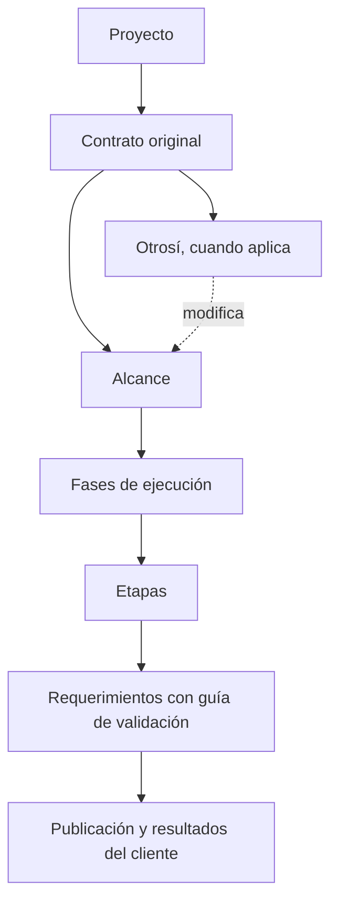

# Alcance y entregas en Platform

Implementación del primer alcance de seguimiento contractual, preparada el
2026-10-01. La integración y el despliegue se consultan en el PR de la sesión;
este documento describe el comportamiento del código, sin declarar un despliegue.

En **Proyectos → Entregas**, el equipo prepara las instrucciones que el cliente
usará para comprobar una entrega. La ruta es
`/platform/projects/<id>/delivery`. El panel conserva la ficha comercial,
propuestas y documentos; Platform concentra la preparación y la revisión de
las entregas. La aprobación del cliente queda asociada al contenido que probó.

## Qué se organiza



| Nivel | Qué representa |
| --- | --- |
| Contrato | La base contractual, con un documento existente o un PDF de propuesta como fuente. |
| Otrosí | Una modificación del mismo contrato, con su propia fuente y firma. |
| Alcance | Lo acordado bajo ese contrato y, cuando corresponde, su otrosí. Se conserva el alcance anterior y se identifica el vigente por contrato. |
| Fase | Un conjunto de etapas de ejecución comprensible para el cliente. |
| Etapa | El conjunto de requerimientos que se publica para una revisión. |
| Requerimiento | Una acción o resultado que el cliente puede probar mediante instrucciones sencillas. |

Las fases comerciales existentes (`ProjectPhase`) continúan sustentando las
propuestas y el hosting. Una fase de entrega puede referenciarlas mediante
`commercial_phase_id`; esa referencia no altera cobros, suscripciones ni
activaciones. Las guías se redactan por separado del detalle técnico y comercial.

## Preparar, publicar y revisar

1. El administrador registra el contrato y los otrosí aplicables, selecciona
   una sola fuente documental para cada uno y habilita su consulta al cliente.
2. Redacta el alcance, sus fases, etapas y requerimientos mediante formularios
   o mediante el prompt y la importación JSON. Este contenido queda en borrador.
3. Revisa las guías y los documentos asociados. **Publicar para revisión** hace
   visible la etapa y crea una copia de la versión entregada. El contrato y el
   otrosí aplicable deben estar firmados antes de publicar.
4. El cliente abre la etapa, prueba los requerimientos y registra resultados
   sólo para los que comprobó. Puede **aprobar**, **objetar** o **rechazar** cada
   uno; los demás continúan en revisión. Objetar o rechazar exige explicar el motivo.
5. El equipo consulta los resultados y las respuestas, corrige lo pendiente y
   publica otra ronda cuando el cliente pueda volver a probarlo.

La revisión editorial y la conformidad tienen estados distintos:

| Aspecto | Estados y efecto |
| --- | --- |
| Preparación de la etapa | `draft`: borrador interno; `published`: versión publicada para el cliente. |
| Requerimiento | `pending`: preparado internamente; `in_review`: disponible para probar; `approved`, `objected` o `rejected`: resultado registrado. |
| Etapa y fase | El resumen se deriva de sus requerimientos y etapas. La etapa queda aprobada cuando todos sus requerimientos están aprobados; la fase, cuando todas sus etapas lo están. |

Guardar una redacción interna no acredita conformidad del cliente. El JSON no
puede importar estados de revisión, publicaciones, firmas ni aprobaciones.
El administrador tampoco puede usar la revisión ordinaria para responder como
si fuera el cliente. Una sesión de acceso delegado (`impersonated_by`) puede
consultar el portal, pero no firmar documentos ni registrar resultados como
cliente; esas decisiones requieren iniciar sesión con la cuenta propia.

### Conformidad parcial y segunda ronda

Si el cliente aprueba dos de tres requerimientos, esas dos conformidades se
conservan. El equipo puede corregir el tercero mientras el cliente sigue
consultando la última versión publicada. Hasta su nueva publicación, la versión
modificada no se puede revisar como si fuera la anterior.

Publicar otra ronda vuelve a poner los requerimientos sin aprobar en revisión.
Los aprobados conservan su contenido, versión y conformidad. La respuesta
anterior mantiene el autor, la fecha, el ambiente, la decisión y el contenido
exacto revisado. Una objeción o rechazo necesita una nueva publicación antes de
otro resultado para ese requerimiento.

La guía aprobada y las etapas o fases completamente aprobadas quedan congeladas.
Una ampliación se prepara en otra etapa o fase editable, respaldada por el
alcance y los otrosí que correspondan. No se reescribe lo que el cliente aprobó.

## Cómo redactar una guía

El cliente debe poder ejecutar la prueba sin interpretar archivos, bases de
datos o detalles de programación. Cada guía tiene estos campos:

| Campo | Pregunta que debe responder |
| --- | --- |
| `role` | Nombre real del rol del producto del cliente, sólo si las fuentes lo acreditan. |
| `access` | ¿Con qué acceso o cuenta de prueba entra esa persona? |
| `environment` | ¿Dónde se hace la prueba? |
| `preparation` | ¿Qué debe estar listo antes de empezar? |
| `data` | ¿Qué datos o registros se necesitan? Si no hacen falta, decirlo. |
| `steps` | ¿Qué acciones se hacen, en orden? Una acción concreta por paso. |
| `expected_result` | ¿Qué resultado visible confirma que funcionó? |
| `failure_signals` | ¿Qué permite reconocer un fallo y describirlo al equipo? |
| `allowed_actions` | ¿Qué ve y qué puede hacer con ese acceso? |
| `blocked_actions` | ¿Qué no debe ver o qué no puede hacer? |
| `blocked_steps` | ¿Cómo se intenta una acción bloqueada, en orden? |
| `blocked_result` | ¿Qué resultado confirma que el bloqueo funciona? |
| `dependencies` | ¿Qué etapa anterior debe completar otra persona y qué datos se reutilizan? |

Para publicar se exigen ambiente, pasos, resultado esperado y
señales de fallo. La preparación y los datos también deben explicarse cuando
la prueba los necesita. Evitar instrucciones como «validar el módulo»; indicar,
por ejemplo, qué registro crear, dónde buscarlo y qué debe aparecer.

Las etapas se basan en los recorridos reales del sistema del cliente. Si las
fuentes definen roles, se agrupan preferentemente por responsabilidad y acceso;
una guía explica un caso permitido y otro bloqueado. No se duplican los
requerimientos para agrupar por rol: se referencian las etapas previas en
`dependencies`. Si no hay roles acreditados, se omite esa separación y `role`;
Platform oculta los campos vacíos al cliente. Administrador y cliente de
Platform no son roles del producto que se valida.

En JSON v2, un rol nuevo debe aparecer por su nombre en una cita seleccionada
del contrato, otrosí, anexo o referencia. La comprobación acredita procedencia;
el equipo sigue validando que esa fuente define realmente el perfil y sus
permisos. Las guías manuales v1 conservan compatibilidad y lo aprobado no se
reescribe. La generación ya no propone «Cliente» como rol por defecto.

## Firmas y conformidades anteriores

**Firma en Platform.** El cliente propietario puede leer y aceptar el documento
habilitado para firma desde Entregas o Mis documentos, con las reglas existentes
de identidad y correo validado. Se conserva el nombre, la fecha, el contenido
de origen y una copia privada del PDF firmado.

**Firma externa.** El administrador adjunta el PDF firmado al contrato u otrosí,
indica firmante y fecha y explica cómo constató la identidad y la firma. El
servidor exige un PDF legible, sin contraseña, de hasta 10 MiB y 500 páginas;
conserva el archivo y su huella. Esa constatación administrativa se identifica
como externa y queda congelada. No se acepta una fecha futura.

**Conformidad histórica del cliente.** El administrador publica primero la
guía que representa lo validado y usa **Registrar conformidad externa** para
requerimientos concretos. Sólo admite aprobaciones expresas y distingue la
fecha de conformidad de la fecha y el administrador que la registraron.
La evidencia puede provenir de:

- Una comunicación **entrante**, recibida y no anulada del cliente del
  proyecto, o de su hilo general. El texto transcrito debe citar el contenido
  recibido; se conservan la fuente, el contenido y su huella, el autor y la fecha.
- Un documento con esa conformidad, acompañado del nombre del cliente que
  aprobó, la fecha, el canal y una referencia de origen. Se exige adjuntar la
  evidencia y confirmar que contiene la declaración del cliente.

Una constancia o reporte saliente del equipo no acredita aceptación del cliente.
El registro histórico tampoco permite importar aprobaciones a través del JSON
de redacción. El MCP administrativo utiliza las mismas reglas y actúa como el
administrador; las decisiones ordinarias pertenecen al cliente autenticado.

Los documentos presentados como respaldo de una conformidad histórica se
copian a un PDF privado exacto para esa revisión. `DeliveryReviewDocumentEvidence`
conserva título, archivo y huella; el respaldo queda separado de los documentos
de la guía. El historial muestra esos archivos y su descarga autenticada por
JWT conserva lo registrado aunque cambie el documento de origen.

## Constancia por correo al cerrar una etapa

Cuando todos los requerimientos de una etapa publicada están aprobados, el
administrador puede abrir **Correo de conformidad**. Aprobar la etapa no envía
ningún correo. Primero se prepara una copia con el destinatario del proyecto,
asunto y cuerpo exactos; después se confirma expresamente su envío.

El registro conserva rondas públicas, versiones de las guías, decisiones,
autores y fechas, y conversaciones hasta la operación que cerró la revisión.
Incluye el mensaje público de esa última revisión. Las conformidades externas
distinguen al cliente que aprobó y al administrador que registró la evidencia,
con su canal y fecha original. La trazabilidad identifica contrato, otrosí
aplicable, alcance, fase y etapa. Las notas internas, prompts y contextos
administrativos, y fuentes privadas no se incorporan al correo ni al resumen.

Los adjuntos son opcionales: se puede enviar únicamente el mensaje. El
administrador puede agregar un resumen PDF de la conformidad o seleccionar
copias exactas de los documentos públicos disponibles en la etapa. El servidor
conserva los archivos y sus huellas; no vuelve a generar un documento cambiado
para enviar o reenviar una evidencia anterior. La vista previa y sus descargas
requieren el mismo administrador y canal que prepararon el correo.

Enviar utiliza `EmailDeliveryGateway` y la plantilla
`delivery_stage_approved_client`, con snapshots y auditoría comunes. La captura
persiste antes de SMTP y los adjuntos usan almacenamiento privado, incluso al
recargar desde la base o reenviar desde el historial común. No se agregan rutas
públicas de media para estas evidencias. Si falla una captura, se revierten sus
filas y archivos antes de cualquier transporte.

El historial muestra preparado, enviando, enviado, fallido o desconocido, junto
con cada intento. Un doble clic o una petición repetida no duplica el envío.
Un error posterior a la aceptación de SMTP se identifica como desconocido.
Reintentar una decisión fallida o desconocida exige **Preparar reenvío**,
revisar otra copia y confirmar de nuevo. Un proceso interrumpido puede conservar
el estado enviando; esa incertidumbre tampoco habilita un reintento automático.

Las seis acciones REST tienen equivalentes MCP: preparar, listar historial,
consultar la copia, descargar adjuntos, enviar y preparar reenvío. Sólo enviar
es sensible y consume una confirmación de la vista exacta antes del transporte.

## Documentos y respuestas

Se pueden asociar documentos existentes a proyecto, contrato, otrosí, alcance,
fase, etapa o requerimiento. El catálogo comprueba su pertenencia al proyecto
o cliente; las cuentas de cobro mantienen su superficie financiera.

Los contratos habilitados pueden leerse y firmarse antes de publicar una etapa.
Los documentos de alcance, fase, etapa y requerimiento requieren publicación:
una marca antigua de visibilidad en Documentos no permite abrir un borrador.
Al publicar se guardan copias privadas de los PDF relacionados, incluidos los
documentos de niveles superiores que aplican a esa etapa. Las descargas del
cliente usan esas copias; los anexos de un requerimiento aprobado conservan
la copia de la ronda en que fue aprobado.

Las respuestas pueden referirse a un nivel concreto y a uno o varios
requerimientos de ese nivel, con documentos asociados. Un reporte del equipo
comunica qué se atendió; la decisión del cliente se registra por separado.
Las notas internas sólo las ve el equipo. Una respuesta pública no puede
exponer requerimientos en borrador, y las asociaciones documentales ya
publicadas se conservan como evidencia.

## Prompt e importación JSON

**Crear guías** permite empezar sin una etapa previa. El administrador selecciona
un contrato, opcionalmente uno de sus alcances, los otrosíes pertinentes y los
anexos o documentos de referencia necesarios. No se incluye automáticamente todo
el proyecto ni se sustituye el documento firmado por el detalle comercial o
técnico actual. Cambiar de alcance conserva sólo su otrosí; los otrosíes
adicionales deben seleccionarse de nuevo.

**Preparar respuesta** parte de una etapa publicada y fija su contrato y alcance.
Además de las fuentes elegidas, incluye las guías y versiones publicadas, todas
las rondas, decisiones y observaciones públicas pertinentes, con autor y fecha.
Los documentos públicos de esa conversación se identifican; su contenido sólo
se incorpora si se selecciona expresamente como fuente. Las notas internas no
se incluyen en el prompt.

**Preparar y conservar las fuentes** guarda una selección inmutable, con
identidad, título, procedencia, versión conocida, fecha, huella, copia privada y
fragmentos localizables. El prompt, la plantilla y el esquema forman parte de
esa misma captura. **Historial de prompts** muestra las 50 preparaciones más
recientes; las anteriores siguen ligadas a las guías y respuestas que las usan.
La descarga devuelve la copia original conservada, con su tipo de archivo;
preparar o consultar un prompt no publica guías ni envía mensajes.

Una asociación administrativa o una nota de aplicabilidad no prueba la
incorporación jurídica de un anexo. El contrato u otrosí debe sustentar las
conclusiones de alcance; los anexos pueden aportar respaldo adicional. La
versión o precedencia desconocida, los documentos faltantes y las lecturas
ilegibles o parciales se muestran como advertencias. Un PDF escaneado sin texto
no permite inferir qué incluye o excluye el contrato. Cada fuente tiene límites
de extracción explícitos; exceder el límite global de 100 KB de contexto o
256 KB de respuesta rechaza la captura completa, sin guardar una selección
silenciosamente recortada.

El administrador usa **Copiar prompt** con su herramienta de redacción o IA y
pega el resultado en la preparación abierta. El JSON vigente usa
`schema_version: 2`, el `context_id` devuelto y `source_references` en cada
requerimiento. Cada referencia contiene `source_key`, `locator` y `quote`
obtenidos de los fragmentos conservados. El servidor verifica su pertenencia,
ubicación y cita exacta; esa verificación no sustituye la revisión humana de su
interpretación. La salida no puede cambiar el contrato ni el otrosí de un
alcance seleccionado.

Primero se debe **Previsualizar** y revisar el resumen. **Aplicar borradores**
guarda la jerarquía de forma atómica. Si cambia el JSON, se requiere otra
previsualización. La importación identifica cada elemento por su `key` dentro
del padre: puede crear o actualizar borradores nunca publicados y no elimina
elementos omitidos. Puede incluir ancestros publicados si sus campos enviados
son idénticos, para agregar descendientes nuevos en borrador sin reescribir
el contexto. Rechaza cambiar contenido publicado y agregar requerimientos a
una etapa aprobada o etapas a una fase aprobada. Para corregir una guía ya
publicada que sigue pendiente de conformidad se usan sus formularios y una
nueva ronda.

Al corregir una guía trazada desde su formulario se muestran las citas que se
conservarán. El administrador confirma que siguen sustentando el texto final;
cambiarlo revoca esa confirmación. El servidor exige el contexto y las citas
explícitos y no permite eliminarlos mediante un JSON manual o una actualización
directa. Las guías ya aprobadas siguen congeladas.

### Respuestas propuestas y revisión manual

El JSON de respuesta contiene `schema_version: 2`, `context_id`,
`response_text` y una lista `classifications`. Cada entrada identifica el pedido,
su clasificación, fundamento y citas:

| Clasificación | Tratamiento que pide el prompt |
| --- | --- |
| `inside_scope` | Reconocer y atender lo pactado; agregar la guía faltante en una etapa editable si hace falta, sin cambiar una guía aceptada. |
| `outside_scope` | Justificar con contrato u otrosí y preparar por separado una posible ampliación. No se admite esta conclusión con fuentes incompletas o inciertas. |
| `indeterminate` | Explicar qué fuente o definición falta para determinar el alcance. |

Que algo no figure en una guía no demuestra que esté fuera del contrato.
Las guías y conversaciones conservadas dan contexto de entrega, sin funcionar
como un otrosí. **Previsualizar** valida la propuesta sin compartirla.
**Revisar borrador para enviar** abre el formulario existente, donde el
administrador puede editarla y debe confirmar su revisión antes de enviarla;
adjuntar un documento es opcional. Cambiar las observaciones públicas de la
etapa exige preparar de nuevo el contexto antes del envío. La respuesta
conserva su contexto, citas y clasificación, y puede consultarse desde su
historial. No hay envío automático.

### JSON manual compatible

**Importar JSON** conserva la estructura manual `schema_version: 1`, identificada
como **sin trazabilidad de fuentes**. No degrada ni reescribe una guía trazada.
Para una nueva guía con fuentes se utiliza la plantilla v2 devuelta por su
preparación. Este ejemplo corresponde únicamente a la estructura manual.
Los IDs `101` y `202`
son ilustrativos: antes de usarlo deben sustituirse por el contrato existente
del proyecto y un otrosí que pertenezca a ese contrato. Si no aplica otrosí,
usar `amendment_id: null`. Los IDs de fases, etapas y requerimientos se resuelven
por la jerarquía y sus claves, no se incluyen en el JSON.

```json
{
  "schema_version": 1,
  "scopes": [
    {
      "key": "alcance-operacion-inicial",
      "title": "Registro y consulta de solicitudes",
      "description": "El cliente puede registrar una solicitud y consultar su información.",
      "contract_id": 101,
      "amendment_id": 202,
      "is_current": true,
      "phases": [
        {
          "key": "fase-solicitudes",
          "title": "Fase 1: solicitudes",
          "order": 0,
          "stages": [
            {
              "key": "etapa-registro",
              "title": "Etapa 1: registrar una solicitud",
              "order": 0,
              "requirements": [
                {
                  "key": "crear-solicitud",
                  "title": "Registrar una solicitud con sus datos",
                  "description": "La solicitud queda disponible para consultarla después.",
                  "order": 0,
                  "guide": {
                    "role": "Persona encargada de registrar solicitudes, con cuenta de prueba.",
                    "environment": "Sitio de pruebas indicado por el equipo.",
                    "preparation": "Iniciar sesión con la cuenta de prueba y abrir Solicitudes.",
                    "data": "Usar el nombre Prueba de registro y la descripción Solicitud ficticia.",
                    "steps": [
                      "Elegir Nueva solicitud.",
                      "Completar nombre y descripción con los datos de prueba.",
                      "Guardar y volver a la lista de solicitudes.",
                      "Buscar Prueba de registro y abrir la solicitud."
                    ],
                    "expected_result": "La solicitud aparece una sola vez y conserva el nombre y la descripción escritos.",
                    "failure_signals": "No se puede guardar, la solicitud no aparece, se duplica o cambia algún dato. Indicar el paso y adjuntar una captura."
                  }
                }
              ]
            }
          ]
        }
      ]
    }
  ]
}
```

Se admiten hasta 100 elementos en cada lista y 1000 elementos totales por
operación. Las claves desconocidas, los identificadores repetidos bajo un mismo
padre y las referencias de otro proyecto se rechazan. La aplicación incluye
la versión vigente del seguimiento (`expected_version`) y un identificador
estable de petición (`request_id`); un cambio concurrente exige actualizar la
versión, y un reintento de la misma operación no la duplica.

## API y servicios compartidos

La API usa JWT bajo `/api/accounts/projects/<id>/delivery/`. La interfaz y el
MCP administrativo reutilizan `delivery_workflow`, `delivery_authoring`,
`delivery_source_extraction`, `delivery_documents` y los
serializers estrictos; los permisos se comprueban también en esos servicios.

| Ruta relativa | Uso |
| --- | --- |
| `GET` raíz | Consultar el seguimiento. |
| `GET prompt/options/` (o `GET prompt/`) | Descubrir contratos, otrosíes, fuentes seleccionables y esquemas; no obtiene textos automáticamente. |
| `POST prompt/` | Conservar una preparación de guías o respuesta, con selección explícita e identificador de petición estable. |
| `GET prompt/contexts/`, `GET prompt/<uuid>/` | Listar preparaciones recientes y consultar una captura administrativa inmutable. |
| `GET prompt/<uuid>/sources/<key>/download/` | Descargar la copia exacta de una fuente conservada. |
| `POST reply/preview/` | Validar texto, clasificación y citas sin enviar una respuesta. |
| `import/preview/`, `import/apply/` | Validar el JSON y guardar borradores. |
| `contracts/`, `amendments/`, `scopes/`, `phases/`, `stages/`, `requirements/` | Crear elementos; editar o eliminar por su ID cuando sus reglas lo permiten. |
| `stages/<id>/publish/`, `stages/<id>/review/` | Publicar una ronda y registrar la revisión del cliente. |
| `stages/<id>/historical-approvals/` | Registrar conformidades externas con evidencia, como administrador. |
| `contracts/<id>/signature-external/`, `amendments/<id>/signature-external/` | Constatar una firma externa. |
| `documents/`, `documents/<id>/pdf/`, `messages/` | Asociaciones, descargas autenticadas y respuestas. |
| `reviews/<id>/evidence/`, `reviews/<id>/evidence/<evidence_id>/pdf/` | Consultar y descargar el respaldo privado de una revisión autorizada. |

La herramienta MCP `download_delivery_document_pdf` descarga el mismo PDF:
recibe `link_id` para un documento asociado, o el par `review_id` y `evidence_id`
para un respaldo de revisión. Las dos alternativas son excluyentes y siempre
requieren el contexto del proyecto.

Contratos y otrosí se crean por sus formularios o herramientas administrativas,
antes de importar un alcance. El selector legado `GET .../requirements/`
permanece para bugs y solicitudes de cambio, con los requerimientos visibles de
la nueva jerarquía; ya no existe la escritura de tarjetas Kanban por esa ruta.

## Retiro del modelo anterior y continuidad

La purga de tarjetas antiguas fue autorizada como parte de este cambio. La
migración `accounts.0064_delivery_review_workflow` borra los requerimientos
Kanban anteriores, sus comentarios e historial y los agrupadores
`ProjectScopeItem`. No los transforma en guías ni infiere conformidades; el
paso de purga no reconstruye esas filas al revertirse.

Se conservan proyectos, clientes, fases comerciales, propuestas, documentos,
recursos y archivos, modelos de datos, comunicaciones, bugs, solicitudes de
cambio, cobros, pagos y hosting. Las referencias de bugs y solicitudes a las
tarjetas eliminadas quedan vacías; sus registros permanecen. La fase de una
fuente nueva se obtiene desde su etapa de entrega.

`technical_resources_sync` conserva la sincronización de recursos y modelos
de datos desde propuestas. Ya no crea guías, grupos de alcance ni recalcula
el progreso por tarjetas; su endpoint es `sync-technical-resources/`.
El relanzamiento de onboarding no elimina un proyecto con seguimiento
contractual. `accounts.0066_delivery_review_document_evidence` incorpora el
respaldo privado por revisión. Las migraciones corresponden al despliegue,
nunca al worktree.

Los seeds de pruebas incluyen contrato, otrosí con evidencia externa,
conformidades parciales y una etapa privada. Su reinicio puede limpiar el grafo
protegido únicamente bajo la capacidad explícita de fake data; esa limpieza
no es una operación del cliente ni del workflow productivo.

El reporte de bugs y las solicitudes existentes conservan su integración con
los requerimientos publicados. Una solicitud aprobada puede convertirse en una
guía nueva pendiente dentro de una etapa editable, sin aprobarla por el cliente.
La ampliación del flujo de bugs y los vacíos de cuentas de cobro siguen como
alcances posteriores para trabajar incrementalmente en el mismo PR.

## Estado de los incrementos

El refinamiento de los prompts del primer alcance está implementado para
validación en el mismo PR: «Crear guías» sin etapa previa y «Preparar respuesta»
con fuentes conservadas, citas verificadas y revisión manual. Su integración y
CI se consultan en el PR. `accounts.0067_explicit_delivery_authoring_context`
incorpora las capturas inmutables y su vínculo con guías y respuestas; sólo el
deploy aplica esa migración.

El incremento coordinado incluye roles acreditados por fuentes, una frontera
contractual reutilizable para tickets y la constancia manual de etapa aprobada.
`accounts.0071_delivery_followup`, hija de `0067`, conserva el contexto del
destino ticket y las evidencias privadas de correo. No se modifican migraciones
anteriores ni se aplican migraciones desde el worktree.

El seguimiento general de bugs y las cuentas de cobro pertenecen a otros frentes
coordinados. Su integración la conduce P0; esta rama publica el núcleo y sus
contratos sin absorber sus ramas. Las pruebas de correo usan almacenamiento
temporal y transporte en memoria, sin enviar mensajes reales al cliente.
