> **Building with Us — 2026-10-09:** `/building-with-us` presenta el programa público bilingüe de incubación; `/panel/building-with-us` reúne Programa y Contrato de solo lectura. El contenido del programa y el contrato mantienen versiones independientes y se editan exclusivamente mediante el conector MCP `building-with-us`, con vista previa y confirmación. El contrato conserva un espejo de solo lectura en la carpeta ProjectApp › Contratos del Gestor Documental; el panel consulta su estado y enlaza al documento.

> **Integridad y avisos de entregas — 2026-10-07:** los cambios de ascendencia
> validan el destino y las guías descendientes conservadas; la publicación
> comprueba también otrosí y citas. Panel, Platform y sincronización técnica
> comparten las reglas de fases comerciales. La copia firmada es la fuente
> contractual de publicación y descarga. Los eventos de avisos se registran
> con el cambio y se despachan después del commit mediante el gateway existente.

> **Archivos de recursos — 2026-10-07:** cuatro familias usan
> `PlatformResourceStorage`, con namespaces privado e histórico separados.
> La descarga aplica primero rol y pertenencia; el frontend usa JWT y Blob.
> El inventario identificado por su digest conserva propietario y bytes, incluida
> la consulta de registros retenidos. El bloqueo de rutas históricas HTTP es
> independiente de convertir referencias. [Contrato](../PLATFORM_RESOURCE_MEDIA.md).

> **Permisos de recursos — 2026-10-07:** `project_for_resource_actor` distingue el Request real de Platform del contexto MCP validado. REST exige el rol de Platform para autoridad administrativa y filtra por propietario; los flags Django staff/superuser por sí solos no amplían esa interfaz. MCP conserva su principal técnico cuando conector, actor y credencial coinciden. La regla se comparte entre lecturas, escrituras y descargas.

> **Recursos por MCP — 2026-10-07:** `platform_resources` y `platform_data_model` concentran las reglas de las vistas REST existentes y sus adaptadores conversacionales. `platform_resource_operations` reutiliza la versión y los recibos de entrega con bloqueo de proyecto; el fingerprint incluye el dominio, contenido, propietario y credencial. No cambia el principal técnico ni la autenticación. Las descargas conversacionales pasan por el recurso autorizado y producen artefactos temporales propios. El servicio de avisos es el único dueño del envío.

> **Cobro antes de liquidación — 2026-10-06:** el servidor comparte la política de
> liquidación entre las proyecciones de ingresos y sus escritores individuales y
> masivos. Los contratos se vinculan explícitamente desde Contabilidad reutilizando
> el escritor versionado del seguimiento; las consultas no crean registros. El
> historial conserva sus hechos y corrige la presentación del IVA antiguo al leer.


## Traslado auditado de datos conservados (2026-10-07)

Lo conservado por una eliminación forzada deja de ser un callejón sin salida.
«Asignar registros sin proyecto» de un proyecto vigente del MISMO cliente lista
ingresos, hostings, documentos e hilos de comunicación conservados, con el
proyecto eliminado de origen y posibles duplicados, sin marcarlos por defecto.
Al confirmar, cada contexto de retención genera una `ProjectRetentionOperation`
con los valores de pertenencia antes y después: los ingresos viajan con sus
hijos líquidos y sus cuentas, los documentos que estaban en carpetas
conservadas pasan a la raíz del destino y los hilos toman el proyecto. El
traslado se deshace exactamente mientras nada haya cambiado después. Los
contenedores conservados vacíos (hilos sin mensajes, carpetas sin contenido) se
eliminan con vista previa e impacto vigente. La reasignación de propuestas
acepta como origen el proyecto eliminado y mueve fase, entregables y documentos
conservando sus ids; si una fase vencida entraría a un hosting activo del
destino, exige una fecha de inicio futura o aceptar el cobro. El candado del
modelo sigue rechazando cualquier otra escritura y su mensaje indica el camino.
Servicios: `retained_adoption`, `retained_containers`, `retention_audit` y
`proposal_project_reassignment`; MCP: `list_project_retention_contexts`,
`preview_/undo_retained_operation(_undo)`, `preview_retained_container_cleanup`
y `delete_empty_retained_containers`. Migración nueva: `content.0284`.

## Eliminación selectiva de proyectos (2026-10-06)

La eliminación forzada empieza con todas las categorías apagadas. La selección
explícita y el contenido vigente forman el token de impacto; la API no acepta
volver al borrado total por ausencia de selección. Las dependencias requieren
una elección manual. La ficha del proyecto se elimina, mientras sus datos no
seleccionados conservan cliente y origen mediante ProjectRetentionContext, sin
un proyecto operativo sustituto. Clientes incorpora consulta y descarga; no
habilita edición ni reasignación. Las evidencias inmutables conservan sus
bloqueos, y los cobros/avisos del proyecto retirado dejan de ejecutarse.

Migraciones nuevas: accounts.0077, content.0281, monitoring.0003 y
secure_links.0005. Se aplican mediante deploy, nunca a datos reales desde el
worktree. Las relaciones mutables permiten desvinculación explícita y usan
PROTECT para impedir cascadas de Project fuera del servicio autorizado.

# Architecture — ProjectApp

**2026-10-06 — clave de cifrado fuera de Git:** `credential_cipher` conserva
prioridad de `PROJECT_ACCESS_CIPHER_KEY` y, si falta, lee un archivo privado
bajo `PRIVATE_MEDIA_ROOT/runtime-secrets` o la ruta explícita
`PROJECT_ACCESS_CIPHER_KEY_FILE`. Verifica tipo, propietario y permisos antes
de leer. Las comprobaciones de despliegue releen esa fuente sin cache.
Enlaces, accesos, notas y MCP comparten el mismo cifrador; se conservan sus
contratos y la apertura única. La aplicación nunca genera ni reemplaza claves.

**2026-10-02 — autorización de cuentas:** la lectura de fases limita por
propietario salvo perfil administrador, también cuando el perfil no existe.
El token verificado de recuperación incluye una huella HMAC de la contraseña
vigente. La confirmación usa una actualización condicional por usuario y hash
anterior para consumir la autorización sin sobrescribir un cambio intermedio;
conserva validadores, notificación y sesión tras el guardado exitoso. Repetir el
token o usar uno anterior sin huella retorna el error existente de token
inválido. Los tokens antiguos requieren reiniciar recuperación durante su
ventana máxima de cinco minutos. No cambia el esquema ni los JWT de sesión.

**2026-10-02 — aprobación y vinculación explícita de propuestas:** aceptar por
el enlace público, Panel o MCP sólo registra el estado comercial. El modal
compartido de listado/editor revisa cliente, proyecto y paquete contractual;
permite seleccionar existentes, preparar nuevos registros o posponer.
`proposal_approval_service.review_proposal` confirma en una transacción, con
lock del proyecto antes de la propuesta, hash del origen e idempotencia.
`platform_approval_manifest` congela la selección y el contenido técnico;
`ProposalApprovalFile` conserva copias privadas independientes con tamaño y
SHA-256, vínculos protegidos y descargas autorizadas. El paquete incluye los
detalles comercial y técnico formales y contratos vigentes o múltiples
personalizados, sin alterar originales ni evidencia firmada. La sincronización
es conservadora y ocurre dentro de la confirmación; reintentar mantiene el
mismo proyecto y paquete. Los endpoints Panel fijan sesión/CSRF; Platform
usa `SessionJWTAuthentication` y permisos del proyecto. MCP requiere
confirmación sensible de los assets exactos. `content/0278` depende de
`0277_merge_vat_and_economic_conditions` y del esquema accounts existente.
No crea contratos de entrega, firmas ni aprobaciones a partir de archivos.
Contrato y recorrido: [Aprobación de propuestas](../PROPOSAL_APPROVAL.md).

**2026-09-29 — intereses de módulos:** `BusinessProposal.module_interests` guarda instantáneas del catálogo independientemente de `selected_modules` (alcance contratado). El endpoint público idempotente sólo actualiza intereses; el total manual alimenta panel, web y PDF. La migración materializa recargos antiguos y conserva descuentos heredados. Véase `docs/PROPOSAL_MODULE_INTERESTS.md`.

> **Autenticación y recuperación de fallos — 2026-10-01:** la autenticación
> JWT de sesión usa `SessionJWTAuthentication` y rechaza todo token con `purpose`.
> Los tokens de verificación sólo pueden usarse en verificar/reemitir OTP;
> los de recuperación conservan sus endpoints específicos. El panel mantiene
> sesión Django y CSRF. Incorporar una fase de hosting confirma activación,
> prorrateo y cuotas futuras en una transacción por fase; los avisos ocurren
> después del commit. Refresh de LinkedIn conserva credenciales ante 429/5xx
> y respuestas desconocidas, y sólo las borra ante rechazo explícito admitido.
> No hay nuevos contratos públicos ni garantías de concurrencia.

### Bugs y solicitudes contextualizadas — 2026-10-01

`issue_reports` comparte el ciclo de vida entre REST y MCP; los adaptadores
existentes quedan delgados. `IssueContext` conserva el origen publicado,
`IssueResponse` agrega respuestas, `IssueEvent` conserva estados/recibos y
`IssueAttachment` guarda PDFs históricos privados. El bug general no depende
de contrato o guía. «Resuelto por equipo» admite reapertura del cliente sin
modificar aprobaciones. Se reutilizan almacenamiento e índices de documentos de
entregas. `issue_contract_reply` delega fuentes/citas a P3 y proporciona identidad,
origen congelado y conversación pública real. Publicar revalida dueño, actor,
destino, versiones y hashes bajo `_run`; el JSON guarda procedencia privada y
el serializer expone una allowlist pública. El guard propio impide transferencias
con historia de tickets, después del guard de entregas. `0073` combina `0068`
y `0071` sin operaciones.
Contrato del dominio: [Bugs y solicitudes](../PLATFORM_ISSUE_REPORTS.md).

> **Seguimiento contractual — 2026-10-01:** `ProjectContract` y
> `ContractAmendment` sustentan `DeliveryScope` → `DeliveryPhase` →
> `DeliveryStage` → `Requirement`. Publicaciones, revisiones, evidencias de firma,
> respuestas y copias documentales conservan el contenido entregado. JWT y MCP
> comparten `delivery_workflow`, `delivery_documents` y validación de pertenencia,
> versión y congelamiento. `ProjectPhase` mantiene su función comercial/hosting;
> `delivery_authoring` captura `DeliveryPromptContext` y `DeliveryPromptSource`
> inmutables por selección explícita, con archivos privados exactos, fragmentos
> y límites visibles. Guías y respuestas conservan contexto y citas; el servidor
> verifica las referencias, y la interpretación requiere revisión humana.
> Descubrir fuentes, previsualizar o consultar no publica ni envía contenido.
> `delivery_contract_reply` extiende la misma autoría mediante un proveedor de
> tickets, con propietario, origen y conversación congelados y dos versiones
> independientes; publicar requiere revalidación bajo lock. `delivery_closure_email`
> conserva la constancia y sus intentos privados. REST y MCP envían sólo tras
> revisar una preparación y confirmar manualmente, fuera de la transacción de
> petición, usando snapshots privados del gateway común antes de SMTP. La
> captura fallida limpia archivos; un reenvío requiere otra preparación explícita.
> `technical_resources_sync` sólo refleja recursos y datos. La purga autorizada
> retira las tarjetas antiguas, conserva bugs/cambios y anula sus referencias.
> [Reglas y superficies vigentes](../PLATFORM_DELIVERY.md).
> **Acciones y eliminación de proyectos — 2026-10-01:** `/panel/projects` usa la columna inicial `menu-start` sin título visible y comparte un menú modal de tres puntos con las tarjetas. El servicio de eliminación inventaría todas las relaciones y muestra dependencias con cantidades; sólo permite proyectos sin información operativa o relacionada. La estructura automática vacía se elimina sin dejar huérfanos. La confirmación revalida con lecturas bloqueantes dentro de una transacción y conserva la auditoría duradera. MCP reutiliza las mismas vistas, ofrece la misma vista previa y requiere confirmación sensible. No se agregan estados ni migraciones.

> **Navegación del editor de propuestas — 2026-10-01:** `proposalNavigation`
> centraliza áreas, herramientas y estados permitidos; `useProposalNavigation`
> conserva la herramienta activa, las últimas selecciones por área y el montaje
> diferido por herramienta. Las URLs usan `tab` para el área y `section` para la
> herramienta, aceptan enlaces anteriores y se actualizan con `replaceState`
> preservando otros parámetros y fragmentos, sin repetir `admin-auth`.

> **Arquitectura — IVA contable, 2026-10-01:** el importe canónico permanece
> como total incluido. Captura antes de IVA/total incluido normalizada con
> Decimal en backend y tasa por ingreso, gasto, hosting y cuenta. Tasa nula
> significa sin registrar; cero significa Sin IVA. Documentos congelan base,
> impuesto y total al emitir; PDF y correo consumen esos mismos valores.
> Utilidad, reparto y tratamiento de retenciones conservan sus reglas actuales
> por decisión explícita del operador. La sincronización cuenta–ingreso sólo
> cambia finanzas antes de pagos/deducciones y dentro de la emisión atómica.

> **Enlaces seguros — 2026-09-29:** el estado de entrega se deriva de las
> fechas mediante `lifecycle_status`, sin cambiar `status`. Panel y MCP comparten
> `mark_sent`, una marca manual idempotente con evento, fecha y actor que no
> consume ni revela contenido. Reactivar limpia esa marca y conserva eventos.
> El formulario compartido usa un dropdown con nombre condicional para
> Personalizado, Mensaje confidencial inicial y campos opcionales plegables.
> Contrato y operación: [Enlaces seguros](../secure-links.md).

> **Paridad MCP de Propuestas — 2026-09-28:** `proposal_operations` comparte
> los adaptadores del panel entre `proposals` y `commercial`; `proposal_schemas`
> deriva los campos editables de los serializers y rechaza claves desconocidas.
> Formalización reutiliza el servicio de documentos, con propiedad opcional por
> credencial en `ProposalFormalization`; el actor técnico no determina acceso.
> La confirmación muestra el paquete exacto y conserva resultados fallidos o
> inciertos sin habilitar un reenvío. API y compatibilidad: `docs/PROPOSALS_MCP.md`.

> **Descargas del panel — 2026-09-29:** `usePanelDownload` centraliza la
> petición autenticada, valida respuestas y descarga con la utilidad existente.
> `PanelDownloadLink` conserva el enlace nativo pero evita navegar durante la
> descarga normal; cancela peticiones al cambiar de destino o desmontarse.
> La navegación pública mantiene enlaces reales con aislamiento de ventana.
> El ámbito de la PWA sigue en `/`; Chrome decide la captura según el perfil.
> Guía y comprobación instalada: `docs/PWA_DOWNLOADS_AND_LINKS.md`.


## Regeneración del prerender por pedido (2026-09-28)

La app ya no construye el frontend en producción. `projectapp-huey` corre con el
árbol del proyecto en sólo lectura (escribe sólo `backend/media`, `backend/logs`
y `backend/private_media`), así que el `nuxi generate` en proceso fallaba con
EROFS y mandaba correos a staff. `FRONTEND_REBUILD_MODE` decide el camino:
`request` (fijo en `settings_prod`) y `inline` (desarrollo local, por defecto
con `DEBUG`). `FRONTEND_REBUILD_ENABLED` sigue siendo el interruptor maestro.

- **`request`:** `schedule_rebuild_after_publish(reason=...)` escribe de forma
  atómica (temporal en el mismo directorio + `os.replace`)
  `backend/logs/frontend-rebuild-request.json` con
  `{"requested_at", "updated_at", "reasons"}`: `requested_at` es el primer
  pedido pendiente y se conserva; `reasons` se deduplica y guarda los 20 más
  recientes (`blog`, `additional-modules`, `explainer-video`, `video-resource`,
  `partnership-program`, `reconcile`). Nunca lanza.
- **Regenerador (toolkit):** reclama el pedido antes de leer contenido
  (renombrándolo, o borrándolo sólo si `updated_at` no cambió), construye,
  hace `collectstatic` y, si todo sale bien, escribe
  `backend/logs/frontend-build-marker.json` (`{"started_at"}`) y borra el
  pedido reclamado. Un pedido escrito durante la construcción sobrevive.
- **`inline`:** encola `rebuild_frontend_prerender` como antes; sólo ese camino
  puede enviar `frontend_build_failure`. `run_frontend_rebuild` se salta en
  `request`, así que una tarea encolada antes del cambio no construye ni avisa.
- `reconcile_frontend_rebuild_request` (02:30) reemplaza la reconstrucción
  nocturna: si `rebuild_needed()` ve contenido posterior al marcador, vuelve a
  pedir la regeneración. `latest_published_change()` incluye ahora el
  Programa de Alianza (`FinancingPolicyRevision.created_at` y el paquete COL de
  60 horas), y publicar una política o tocar ese paquete pide la regeneración.
- Las páginas públicas nunca hornean un error: si la API no responde durante
  el build, `/additional-modules` y `/partnership-program` prerenderizan un
  esqueleto neutro que el fetch del cliente reemplaza; el error con reintento
  queda sólo para cuando también falla la carga en vivo.

## Personalización de datos del servicio (2026-09-28)

`ServiceContractTermField` distingue presets numéricos y texto libre sin cambiar
el contrato API. Sólo identifica como preset el texto exactamente canónico;
los demás valores se reabren editables. `ContractParamsModal` recibe estado de
envío y errores normalizados de sus páginas huésped; éstas mantienen la instancia
y su borrador ante fallos y la cierran únicamente tras guardar correctamente.


> **Recursos comerciales de video — 2026-09-28:** Alianza y Módulos adicionales incorporan MCPs independientes. Panel y MCP comparten cargas MP4 hasta 250 MiB, validación antes de sustituir y almacenamiento privado. Propuestas administra un genérico por idioma y un personalizado opcional después de la bienvenida en ambas vistas comerciales. Contratos, permisos, operación y activación de infraestructura: [Recursos de video](../COMMERCIAL_VIDEO_RESOURCES.md).

> **Video de bienvenida de propuestas — 2026-09-27:** el acceso público muestra
> una pieza genérica en español antes de elegir modo, solo si están disponibles
> las cuatro opciones. `BusinessProposal.show_explainer_video` conserva la
> preferencia individual y `ExplainerVideoSettings.show_proposal_video` controla
> todo el módulo. El serializer admin devuelve la preferencia; el público
> calcula la visibilidad con ambos controles, idioma ES, propuesta activa,
> contrato y detalle técnico habilitados. Reutiliza las secciones ya serializadas
> y consulta el singleton solo cuando la propuesta reúne esas condiciones.
> UUID, slug, enlaces compartidos y preview usan el mismo serializer público.
> El control nuevo no agenda rebuild: la propuesta obtiene sus datos al abrirse.
> El reproductor compartido se pausa antes de elegir modo y al desmontarse.

## Datos configurables del contrato de servicio (2026-09-27)

`CompanySettings.service_contract_settings` almacena dos listas numéricas
(duración y preavisos) y tres preselecciones. El GET existente de
`proposals/company-settings/` expone el objeto; PATCH, reservado a administradores,
valida y reemplaza únicamente ese objeto completo mediante un solo UPDATE.
Propuestas → Configuraciones lo administra y el modal lo consulta en cada apertura.
Los parámetros contractuales siguen siendo texto: `ServiceTermField` convierte
enteros de 1–999 con `num2words` y preserva cadenas históricas. La duración lleva
mes/meses; las plantillas agregan días calendario a los preavisos. La configuración
no cambia contratos existentes ni agrega una superficie MCP.

> **2026-09-26 — enlaces seguros:** app Django `secure_links` (`SecureLink`,
> `SecureLinkEvent` inmutable salvo eliminación del enlace) con `services.py` como única frontera de
> escritura para panel (sesión/CSRF + `IsAdminUser`), página pública (sin
> autenticación DRF; la sesión Django sólo reconoce staff) y las herramientas del
> conector MCP `communications`. Payload JSON cifrado con el mismo Fernet de
> accesos de proyecto; token en el fragmento de la URL, buscado por SHA-256 y
> recibido en el cuerpo del POST. El revelado bloquea la fila y consume en la
> misma transacción; el estado se deriva de fechas. Nuxt: `/panel/secure-links`
> con store Options `secure_links`, páginas SPA `/secure-link` y
> `/secure-link/view` fuera de analítica, navbar y prerender.

> **2026-09-25 — videos comerciales brag v2:** el frontend reutiliza el player
> y los flags existentes con dos MP4 de 45 segundos en español. Brag dirige
> la autoría; Hyperframes y FFmpeg producen offline desde `explainers/brag-v2/`.
> La edición v1 queda archivada en sus rutas originales; no hay cambios de API
> ni dependencias nuevas en el runtime del sitio.

> **2026-09-24 — copia de documentos:** El contrato guarda el snapshot Markdown junto al PDF en `ProposalDocument`; los anexos formalizados reutilizan el PDF original y Markdown extrae su texto (regla actualizada el 2026-09-29). Los nuevos GET administrativos de exportación son privados y de sólo lectura. La extracción de adjuntos ocurre en un proceso local limitado; no utiliza servicios externos.

> **CAPTCHA de acceso — 2026-09-23:** `projectapp.recaptcha` centraliza la
> validación de reCAPTCHA v2 para Django Admin (formulario nativo) y el login
> JWT de Plataforma. Se ejecuta antes de credenciales, sesión, JWT u OTP;
> cualquier indisponibilidad bloquea el intento. El widget Vue y el script
> nativo manejan expiración y reintento. No hay cambio de modelos ni auth de
> sesiones existentes. Configuración y pruebas: `docs/LOGIN_CAPTCHA.md`.

> **Historial por registro — 2026-09-22:** `EntityHistory` y `EntityRevision` conservan identidades y versiones independientes de las filas vivas. La frontera ORM y los contextos HTTP/MCP/servicio agrupan cambios transaccionales, relacionan evidencias antiguas y separan secretos cifrados de instantáneas consultables. Visor común en Documentos, Propuestas, Proyectos, Clientes y Contable. Contrato: `docs/ENTITY_HISTORY.md`.

> **Interfaz comercial pública — 2026-09-19:** catálogo, selecciones y Programa
> de Alianza comparten `PublicDocumentAction` y `PublicDocumentShareButton`,
> con el patrón de propuestas (tema/guía a la izquierda; PDF/compartir sobre
> WhatsApp a la derecha). `usePublicDocumentTheme` comparte el tema entre la
> página y su visor por provide/inject, aislado por clave de almacenamiento;
> `.public-document-theme` delimita la paleta en página, modales y guía.
> El panel usa `/panel/partnership-program`, `/new` y `/:id`; Django redirige
> las rutas antiguas con 301 antes del fallback, y Nuxt conserva query/hash
> en navegación interna. API, modelos y namespace `financing` se mantienen.

> **PWA del panel interno — 2026-09-19:** el frontend generado incluye
> manifiesto y worker nativo, servidos por rutas Django explícitas en la raíz
> con MIME correcto y revalidación. El plugin client-only registra el worker
> desde el panel en builds de producción. El scope raíz conserva las rutas
> localizadas y el login Django; el handler solo intercepta navegaciones GET
> del panel/login y devuelve HTML autónomo al fallar la red. No usa Cache
> Storage ni guarda HTML autenticado, APIs o documentos. Las actualizaciones
> esperan el cierre de los clientes existentes, sin recargas forzadas.

## Monitoreo operativo (2026-09-19)

La app Django `monitoring` separa inventario técnico (`Resource`, `Source`),
credenciales de máquina con alcance explícito, entregas idempotentes (`Delivery`),
casos de seguimiento (`Case`, `CaseActivity`) y reportes informativos (`Report`).
La identidad histórica del recurso se guarda como snapshot; el vínculo opcional
con `accounts.Project` se establece explícitamente y no dirige la ingestión.

`/api/monitoring/v1/ingest/` usa Bearer con hash almacenado; las API del panel
son FBV con sesión/CSRF e `IsAdminUser`. Un lock por fuente serializa la ingestión;
las mutaciones manuales bloquean el caso y comparan `version`. La condición técnica
y el estado humano son independientes. La cola SQLite del toolkit amortigua fallos
de ProjectApp y conserva envíos hasta el acuse, sin sustituir los correos.

La página `/panel/monitoring` reutiliza `request_http` y un store Pinia Options.
Los listados e historiales están paginados; los reportes/evidencias grandes sólo
se cargan en detalle. La tarea de retención es acotada por lotes. Alcance, contrato,
seguridad y activación manual: `docs/monitoring.md`.

> **Programa de Alianza y visibilidad de videos explicativos 2026-09-14:** el
> módulo público de financiación se presenta como "Programa de Alianza" /
> "Partnership Program" (financiación, exclusividad y custodia, calculadora,
> paquete mensual y reglas de pago). Su ruta pública pasa a
> `/partnership-program` y `serve_nuxt` responde 301 desde
> `/<locale>/financing[/…]` (y `/financing` → es-co) antes de buscar archivos,
> así ningún prerender viejo contesta. API, modelos y namespace i18n
> conservan `financing`; los otrosíes siguen siendo "de
> financiación". `ExplainerVideoSettings` (singleton `pk=1`) guarda un
> interruptor por módulo y `AdditionalModuleShareLink.show_explainer_video`
> uno por enlace; `explainer_video_visible()` los combina —el del catálogo
> manda— y las vistas públicas exponen un único `show_explainer_video` (fuera
> de los serializadores de contenido, que también alimentan los PDF). Un
> cambio de interruptor entra en `latest_published_change()` y pide la
> regeneración del prerender (`schedule_rebuild_after_publish`). En Vue, `ExplainerVisibilityToggle` y el store
> `explainer_videos` (optimista con reversión) viven junto a la tarjeta
> compacta, fuera de ella; el video se ve si el interruptor está encendido y
> existe render para el idioma. El video de financiación conserva el nombre y
> la URL anteriores hasta un re-render.

> **Estándar de presentación de vistas públicas 2026-09-04:** toda vista
> pública de módulo (catálogo de módulos adicionales, financiación) abre con
> H1 → tarjeta de video explicativo (`ExplainerVideoCard`, poster + play con
> sonido, primer paso del tour) → tour guiado que corre una vez por navegador y
> se reinicia desde un FAB → toggle de tema → FABs de PDF/compartir. El motor
> del tour es `PublicGuidedTour` (props `steps`, `storageKey`, `testIdPrefix`,
> `labels`; expone `start`/`forceStart`); `AdditionalModules/Onboarding` y
> `Financing/Onboarding` sólo aportan pasos e i18n. Los videos se producen
> offline en `explainers/` con HyperFrames desde la API pública y se publican
> como assets con hash (`frontend/assets/videos/explainers/`); el panel reusa la
> tarjeta en variante compacta y la vista previa de financiación la desactiva
> con `showExplainer=false`. Esa entrega no sumó páginas, endpoints ni modelos;
> desde 2026-09-14 un interruptor persistido decide si la tarjeta se muestra
> (nota superior).

> **Orden persistente de ingresos 2026-09-04:** `useTableSort` admite una
> ordenación base opcional, ciclo de retorno a esa base y estado validado en
> `localStorage`; `useAccountingCrudPage` sólo reenvía ese contrato. Ingresos
> usa `period_date` como accessor ISO de la etiqueta Mes y aplica el resultado
> al conjunto filtrado antes de paginar o agrupar. `IncomeGroupedTable` expone
> el mismo estado controlado y emite la columna elegida; `groupByClient` conserva
> el orden financiero de los grupos y recibe ya ordenadas las filas internas.
> No cambian API, modelo ni ordenamiento backend.

> **Detalle seguro de accesos por proyecto 2026-09-05:** `Project` conserva las
> URLs del producto, mientras `ProjectAdminAccess` separa credenciales de
> producción/staging y `ProjectAccessNote` normaliza notas múltiples; contraseña
> y contenido se cifran con el mismo límite Fernet. Handlers FBV compartidos
> proyectan el contrato por sesión/CSRF al modal del Panel y por JWT a la ruta
> scoped de Plataforma, ambos sólo para administradores. Los payloads usan
> `no-store`, los secretos sólo salen por endpoints de reveal, el frontend los
> retiene en refs efímeras y todo el detalle operativo queda fuera de MCP. La
> migración automática sólo clasifica datos legacy ante una coincidencia de
> hostname única; el resto requiere una decisión explícita sin overwrite.

> **Capas flotantes y proyección de candidatos 2026-09-04:** `BaseModal`
> continúa siendo dueño de su floating root y `BaseTooltip` lo descubre por el
> contexto inyectado; los overlays de ayuda quedan en la misma jerarquía visual
> que el diálogo, mientras usos independientes siguen teletransportándose a
> `body`. La agrupación de candidatos no crea estado de dominio: filtra primero,
> proyecta grupos y agregados en `utils/receivables` y entrega ese contrato al
> mismo `IncomeGroupedTable` usado por Ingresos. Modal y store conservan sus
> responsabilidades: la presentación es efímera y las mutaciones de selección o
> confianza continúan en el endpoint ordinario de ingresos.

> **Arquitectura de destinatarios múltiples 2026-09-04:**
> `email_recipient_service` es la frontera común de normalización, validación,
> límite combinado y atribución de clientes para los envíos manuales.
> `EmailDeliveryGateway` obtiene los grupos To/CC/BCC del mensaje, captura To/CC
> en el snapshot y deja un `EmailLog` por dirección con `recipient_kind`, pero
> conserva un único `delivery_id`. Las consultas eligen una fila Para estable
> como representante y expanden filtros, destinatarios, estados y deep links al
> grupo completo. El frontend concentra chips, búsqueda de clientes, entrada
> manual y reglas cruzadas en `EmailRecipientFields`/`EmailRecipientPicker`; los
> cinco compositores y el reenvío consumen el mismo contrato.

> **Previsión contable manual corregida 2026-09-04:** `IncomeRecord` separa
> `is_receivable_candidate` de `collection_confidence` y protege por constraint
> que una selección activa sea esperada y de empresa. `accounting_service`
> concentra la consulta global de candidatos abiertos y sus agregados; el
> serializer conserva cada eje cuando cambia el otro, y los flujos de liquidación
> deseleccionan al cerrar preservando la clasificación. REST y MCP proyectan el
> mismo contrato, sin migración adicional ni backfill de estados existentes. En
> Vue, `ReceivableConfidenceDot` centraliza los tonos semánticos y el estado
> neutro; badge, tabla, modal, alta/edición y detalle lo reutilizan. El formulario
> envía nivel e inclusión como decisiones explícitas y una duplicación reinicia
> ambos. `panelNav` sustituye sólo el acceso rápido Ads por Cuentas de cobro; el
> submenú contable conserva ambos módulos. `UtilityStatsPanel` reemplaza el
> modal/gráfico del hero y `useChartTheme` sigue siendo la frontera común de
> contraste claro/oscuro.

> **Implementado — plataforma MCP operativa 2026-09-02:** el registro de
> herramientas se convierte en una capa común de metadatos, riesgo, resultados
> estructurados y auditoría. Los conectores canónicos se agrupan en Operaciones,
> Comercial, Proyectos, Documentos, Comunicaciones, Contenido, Tareas y tres
> dominios contables. Los handlers siguen delegando en los serializers y
> servicios del Panel. Credenciales con alcance, contexto de actor, ETags y
> confirmaciones de un solo uso protegen los cambios concurrentes y sensibles;
> los slugs existentes continúan como adaptadores compatibles.

> **Política de financiación versionada 2026-09-03:**
> `FinancingPolicyRevision` conserva revisiones append-only y cada
> `FinancingAgreement` apunta por `PROTECT` a la versión que gobierna sus topes,
> calendario y contrato. `financing_policy_service` valida y publica la versión
> siguiente bajo bloqueo transaccional, convierte USD con la tasa global de
> `AccountingSettings` y congela esa tasa en el acuerdo. Programa público,
> booklet, formulario, calendario y plantilla contractual proyectan la misma
> política vigente; acuerdos bloqueados nunca cambian y los borradores antiguos
> sólo avanzan mediante una acción explícita que deja evento de auditoría.

> **Entrega validada — workspace contractual de financiación (2026-09-03):**
> una entidad de acuerdo, una plantilla versionada y un historial inmutable
> separan la gestión contractual de la fuente comercial pública. Un servicio
> de dominio es dueño de calendario, snapshots, numeración `OFIN-YYYY-NNN`,
> transiciones y elegibilidad del segundo ciclo. Ninguna transición altera
> registros de Hosting o contabilidad: la penalización se documenta para el
> contrato y su aplicación operativa continúa siendo manual y auditable.

> **Módulo de financiación 2026-09-02:**
> `FinancingProgramService` es la fuente canónica, versionada y bilingüe del
> contenido comercial. Proyecta el paquete activo de 60 horas desde
> `HourPackage` y, si el catálogo no lo ofrece, devuelve un fallback explícito
> con `catalog_synced=false` sin ocultar la discrepancia al Panel. Las vistas
> públicas `financing_program` y `financing_program_pdf` exponen el mismo
> contrato como JSON y booklet ReportLab; no crean modelos ni escriben datos.
> La ruta pública Nuxt consume ese JSON con SSR/prerender y refresco en cliente,
> mientras `/panel/financing` reutiliza el cliente HTTP de contenido para
> previsualizar, copiar, abrir y descargar la URL canónica. El componente
> `Financing/ProgramView` concentra idioma, tema, acordeones, acciones PDF,
> compartir y CTA, de modo que Panel y público no diverjan en las condiciones.

> **Lectura paginada del Gestor Documental 2026-09-02:**
> `document_query_service` concentra filtros, búsqueda, raíz contextual y orden
> en un queryset lazy compartido por el listado heredado y
> `GET /api/documents/browse/`. El browser cuenta y corta primero; sólo después
> ejecuta los `select_related`/`prefetch_related` de las 10 filas de tabla o 12
> tarjetas. `DocumentBrowseSerializer` proyecta estados activos sin eventos,
> notas ni actores de auditoría, mientras `/api/documents/` conserva su array y
> contrato para editores y selectores. Pinia mantiene paginación autoritativa,
> restaura `?page` y usa `AbortController` más un token de última respuesta para
> que una carpeta superada no repinte la vigente. El árbol de carpetas sigue
> cargándose completo porque alimenta navegación y rollups; el contenido pesado
> de documentos ya no viaja completo en cada cambio.

> **Tracking confiable de propuestas 2026-09-02:** el `GET` público conserva
> expiración y presentación, pero no escribe métricas comerciales. El navegador
> confirma una vista mediante un heartbeat validado después de cinco segundos
> visibles; `ProposalTrackingService` serializa por propuesta, crea o actualiza
> sesión/secciones y mueve contador, primera vista, estado comercial, actividad y
> alerta persistente dentro de una sola transacción. `ProposalViewEvent` conserva
> `last_seen_at` y `finalized_at`. La alerta por email usa un estado durable en
> `BusinessProposal`, reintentos Huey y reconciliación cada cinco minutos; el tab
> Analítica muestra intentos/error/confirmación y permite reintentar sólo fallos.
> La migración marca vistas históricas como `legacy_unverified`, sin enviar
> correos retroactivos.

> **Tono financiero de correos contables 2026-09-02:**
> `accounting_email_service` clasifica cada `AccountingChangeLog` como ingreso,
> egreso o neutral antes de renderizar `accounting_change.html`. Las entidades
> de dirección fija se resuelven por tipo; Bolsillo usa el snapshot inmutable
> `movement_direction` guardado con el evento, no el registro vivo. La migración
> `content.0237` recupera ese dato en eventos históricos cuyo diff lo permite y
> deja el resto neutral. Así Huey y los reintentos reconstruyen el mismo color
> aunque el movimiento haya cambiado o desaparecido. REST, MCP, panel y los
> demás templates de correo conservan sus contratos.

> **Orden documental por fecha 2026-09-02:** el endpoint de listado anota
> `_display_sort_date` con la misma fecha que serializa cada fila —`created_at`
> en activos y `Coalesce(archived_at, created_at)` en archivados— y aplica en el
> servidor `recent|oldest` con desempates estables. Pinia mantiene `dateOrder`
> para la vista del Gestor, mientras `useDocumentFilterQuery` proyecta únicamente
> el estado no predeterminado como `?order=oldest`; cada recarga por búsqueda,
> filtros, carpeta, scope o vista lo pasa de forma explícita para no contaminar
> otros consumidores del store. Tabla y control compacto comparten la misma
> acción. El estado y la URL sólo se confirman después de una respuesta exitosa,
> de modo que un fallo conserva filas, dirección y navegación previas.

> **Cuenta de cobro como artefacto documental 2026-09-02:** la emisión cruza el
> límite editable y llama a `collection_account_snapshot_service`, que renderiza
> una vez, valida los bytes, guarda `Document.generated_file` y registra SHA-256
> y procedencia. Las vistas de Contabilidad, Plataforma y Documentos, además del
> envío/reenvío, leen ese archivo; sólo las filas históricas sin referencia usan
> el fallback transitorio. El backfill elige primero el
> `EmailAttachmentSnapshot` exacto y marca aparte cualquier reconstrucción. El
> editor reconoce `is_generated_snapshot`, presenta datos contables + visor PDF
> de sólo lectura, conserva observaciones/hilos/archivo y añade una ruta de
> carpetas navegable. Las superficies Markdown/PDF comparten límites de ancho y
> alto cercanos a una página, con scroll interno.

> **Visor público de Módulos adicionales 2026-09-01:** `CatalogView` compone
> `useAdditionalModulesTheme`, `AdditionalModules/Onboarding`,
> `AdditionalModules/ShareButton` y el descargador PDF existente. Tema y guía
> ocupan la banda flotante izquierda; compartir y PDF, la derecha. La descarga
> de cabecera y la flotante comparten una sola operación y estado. `BaseModal`
> acepta un tema local opcional porque su contenido teletransportado queda fuera
> del árbol con `data-theme`; así el detalle mantiene el tema del catálogo sin
> afectar otros consumidores. La guía filtra pasos cuyos targets no existen y
> compartir toma la ubicación vigente del navegador para conservar el UUID. No
> hay cambio de API, tracking, modelos ni esquema.

> **Modal de transición ordenado 2026-09-01:**
> `ProjectStateTransitionModal` compone `BaseFormField` para que estado destino,
> decisión por ingreso y nota sean dueños de su validación visible y ARIA.
> `reviewAttempted` delimita los errores previos al preview; las fallas del
> preview y de la confirmación permanecen en la sección que ejecuta cada acción.
> `BaseModalActions` contiene únicamente Cancelar/Confirmar y reutiliza las
> mismas razones de bloqueo para su estado deshabilitado. Catálogo, endpoints y
> reglas financieras no cambian.

> **Calendario contable validado 2026-09-01:** la tarea Huey
> `send_payment_calendar` ejecuta diariamente `run_payment_calendar` y reúne en
> un solo digest los ingresos, recurrentes y hostings que alcanzan su hito. El
> estado de cadencia sólo avanza después de una entrega aceptada; cada
> destinatario interno recibe su propio `EmailLog` con `EmailLogTarget` para
> todos los registros incluidos, también cuando el SMTP falla. La proyección de
> ingresos carga `client__user` y usa `build_client_display_name`, única fuente
> canónica para mostrar persona, empresa o correo sin caer en la representación
> técnica de `UserProfile`.

> **Seguimiento comercial 2026-09-01:** `content.utils.is_staff_session` es la
> frontera común que consulta la sesión Django subyacente antes de cualquier
> escritura de analytics comerciales. La usan catálogo adicional, propuestas y
> diagnósticos, incluidos enlaces secundarios y eventos de interacción; sin
> sesión staff el request conserva el comportamiento público anónimo. Los
> endpoints públicos de tracking de diagnósticos desactivan autenticación DRF
> para preservar esa sesión sólo como señal de exclusión, sin convertirla en un
> requisito de acceso. En frontend, `app.vue` excluye toda ruta
> `/additional-modules` del Navbar global y los recursos creados desde el panel
> inicializan `es`, manteniendo el cambio explícito a inglés.

> **Interacción de iconos refinada 2026-09-01:** `BaseButton` es la frontera transversal
> para la activación inmediata de controles icon-only, tanto botones como
> enlaces. Un contenedor interno aísla el salto de 420 ms de cualquier transform
> de posicionamiento del consumidor, y un ciclo alternado reinicia la animación
> ante clics rápidos. No se anima el borde y el foco queda reservado a
> `focus-visible`. `BaseActionButton` agrega el glifo canónico y, sólo tras una
> copia verificada, lo sustituye temporalmente por el check de completado;
> `useClipboardFeedback` concentra la
> semántica real de copiar y sus temporizadores por clave. Un guard estático
> cubre componentes, layouts y páginas.

> **Acceso comercial 2026-08-31:** `AdditionalModules/QuickAccess` es la
> superficie compartida entre `/panel/additional-modules` y `/panel/`.
> `useAdditionalModulesPublicAccess` proyecta la URL canónica por locale y la
> descarga completa; las selecciones siguen usando el store y sus modales
> existentes. `panel_dashboard_service` agrega sólo conteos operativos y la
> última apertura: considera vigente un enlace activo con al menos un módulo y
> una categoría activos, pero conserva la última apertura histórica aunque el
> enlace ya se haya revocado. No cambia el esquema ni el contrato público.

> **Comunicaciones 2026-08-30 — implementado:**
> `CommunicationPanelPreference` es la fuente por administrador de los defaults
> visuales y del compositor. La URL y las vistas guardadas conservan precedencia;
> el store tolera una falla de este recurso sin bloquear el listado y sólo importa
> una vez los valores locales legados. Hilos, mensajes y MCP no cambian.

> **Contrato de formularios 2026-08-29:** las superficies de creación del panel
> componen `BaseFormField` + control base + `BaseModalActions`. El campo es dueño
> de su ayuda, error y relación ARIA; el modal sólo coordina payload y errores
> del store. La creación de clientes sigue siendo una capacidad explícita del
> selector compartido, no una salida descubierta después del fallo. No cambia
> el contrato REST ni el modelo de datos.

> **Comunicaciones 2026-08-30:** `/panel/communications` has two list
> projections over the same thread DTO: a comparison table at landscape+ and a
> compact card index below it. `CommunicationThreadTable` owns both projections,
> renders the thread title as the sole **Asunto** content and leaves every message
> body in the workspace modal. The former browser-local order value is now a
> one-time migration input for the account preference; the canonical URL keeps
> precedence over that default.

> **Engagement 2026-08-29:** el navegador es dueño del ciclo visible/oculto del
> tracker. `visibilitychange` delimita segmentos de atención; `sendBeacon`
> entrega el cierre y el POST periódico queda reservado a una página visible.
> El endpoint y el modelo de analytics no cambian.

> **Actualización — 2026-08-28:** `EmailDeliveryGateway` crea obligatoriamente
> un `EmailDeliverySnapshot` antes del SMTP. El destinatario principal y sus
> intentos BCC comparten cuerpo, archivos y enlaces; cada adjunto conserva hash,
> tipo, tamaño y procedencia documental. `EmailLog.snapshot` y la relación
> protegida con `Document` permiten navegar y auditar la entrega en ambos sentidos.

> **Ampliación 2026-08-30:** el dominio `AdditionalModule` mantiene categorías,
> módulos, enlaces compartidos y aperturas únicas por sesión. El parámetro
> `lang` selecciona la proyección ES/EN en catálogo y PDF; un enlace compartido
> usa su idioma de autor como valor inicial, pero admite cambio local del lector.
> `useAdditionalModulesViewMode` conserva tarjetas/lista/acordeón en claves de
> navegador separadas para panel y público. `AdditionalModulePdfService` recibe
> un destinatario efímero, lo escapa y no lo persiste; los enlaces sí reutilizan
> el destinatario ya guardado. La migración `content.0229` incorpora cinco
> módulos al esquema existente, sin ampliar modelos ni exponer MCP.

## 1. System Overview

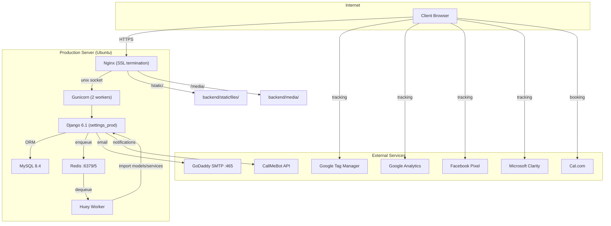

---

## 2. Development Architecture

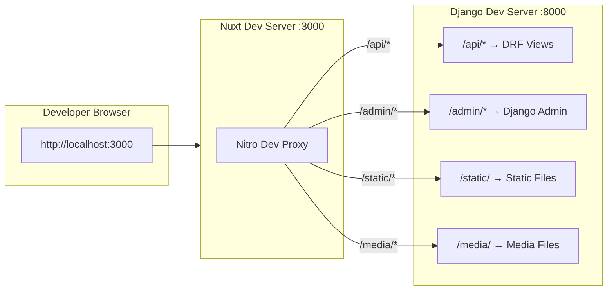

---

## 3. Request Flow

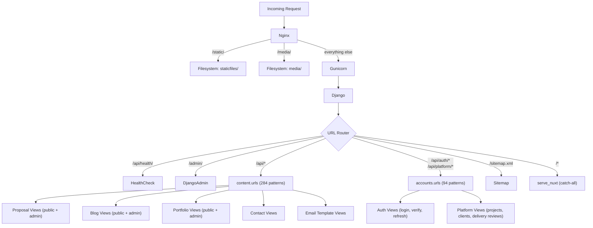

### Documents list-detail navigation

The Documents list owns its navigation state in the route query. Filters, global
search, normal/archived scope, list/grid mode and pagination are therefore
shareable and restorable browser history entries rather than component memory.
Project/client and folder are complementary coordinates while the folder belongs
to the selected entity. Only moving to an own or unrelated folder drops both
entity axes; this prevents the sidebar from selecting **All** inside a project
hierarchy.
Opening an editor copies the complete localized list route into `from` and adds the
document id as `focus` for the explicit return path.

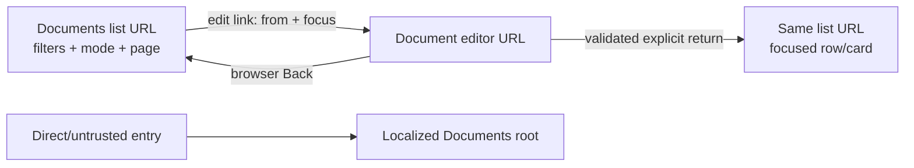

`frontend/utils/documentReturnNavigation.js` accepts only same-application routes
whose localized path resolves to `/panel/documents`; it rejects protocol-relative,
external and cross-module destinations. `useDocumentFilterQuery` owns bidirectional
route/state synchronization. `contextualFolderFilters` classifies the destination
from its actual `project`/`client` association rather than `folder_kind`, and the
same result feeds plain-click state and the real folder-link URL. This flow is
frontend-only and does not change the Documents API or schema.

### MCP ingress and throttling

Remote MCP connectors enter through `/api/mcp/<slug>/<token>/`. Django validates the capability token, connector active state and allowed Origin before dispatching JSON-RPC tools. Anonymous throttling is isolated by `client IP + registered connector slug`; concurrent startup traffic for one connector therefore cannot exhaust another connector's quota. Any unregistered slug maps to the shared `unknown` bucket so callers cannot evade throttling by manufacturing paths.

`TOOLS_BY_SLUG` dispatches nine module catalogs: blog, documents, proposals,
diagnostics, clients, tasks, accounting, LinkedIn personal and communications.
The Communications catalog exposes fourteen tools: list/open/create/edit,
close/reopen and archive/restore threads; create/edit/delete outgoing drafts;
record a confirmed send; annul historical messages; and correct their date. Its
writes delegate to `communication_service.py`, so client ownership, project
scope, thread lifecycle, direction/channel/status transitions, reply linkage,
audit history and protected Document references are identical to the panel.
Draft edits lock the row and append `CommunicationMessageRevision` inside the
same transaction. No message tool invokes provider delivery.

MCP parity is an architectural boundary, not informal documentation.
`content/mcp/contracts.py` classifies every concrete field of every exposed model
as read-only, read-write or intentionally excluded with a reason. Contract tests
reject an unclassified/stale field and validate unique snake-case tool names,
descriptions and object schemas. The repeatable manual/API matrix lives in
`docs/MCP_VALIDATION_RUNBOOK.md`.

The Documents connector treats client delivery copy and observations as private
document metadata. `client_email_subject`, `client_email_body`,
`client_whatsapp_message`, and the ordered legacy `client_custom_notes` array travel
beside the report markdown, not inside it. `client-report` creates one canonical
message triple and passes it to `create_document`/`update_document`; an enclosing
`client-message` run returns those same values. Normalized `DocumentNote` rows may be
opened and resolved through the admin or Documents MCP, including their optional link
to a needs-fix episode. The admin edit modal persists the four communication fields
with a notes-only partial update and advances only their unsaved-change baseline;
normalized observations use their own audited workflow endpoints. The create modal
applies communication notes to the draft until the document exists. The PDF renderer,
list serializers, and platform serializers expose none of this private metadata.

---

## 4. Data Model

### 4.1 Model Inventory

```mermaid
erDiagram
    BusinessProposal ||--o{ ProposalSection : "has sections"
    BusinessProposal ||--o{ ProposalAlert : "has alerts"
    BusinessProposal ||--o{ ProposalViewEvent : "has view events"
    BusinessProposal ||--o{ ProposalChangeLog : "has change logs"
    BusinessProposal ||--o{ ProposalShareLink : "has share links"
    BusinessProposal ||--o{ EmailLog : "has email logs"
    EmailDeliverySnapshot ||--o{ EmailLog : "evidence shared by"
    EmailDeliverySnapshot ||--|| EmailBody : "retains body"
    EmailDeliverySnapshot ||--o{ EmailAttachmentSnapshot : "retains exact files"
    EmailDeliverySnapshot ||--o{ EmailLinkSnapshot : "retains links"
    Document o|--o{ EmailAttachmentSnapshot : "source of"
    BusinessProposal ||--o{ ProposalRequirementGroup : "has requirement groups"
    BusinessProposal ||--o{ ProposalDocument : "has contract documents"
    BusinessProposal ||--o{ ProposalProjectStage : "has execution stages"
    ProposalRequirementGroup ||--o{ ProposalRequirementItem : "has items"
    ProposalViewEvent ||--o{ ProposalSectionView : "has section views"
    Document }o--o{ UserProfile : "created by (optional)"
    Document ||--o{ DocumentStateEpisode : "has workflow episodes"
    DocumentStateGroup ||--o{ DocumentState : "groups catalog states"
    DocumentState ||--o{ DocumentStateEpisode : "occurs as"
    DocumentStateEpisode ||--o{ DocumentStateEpisodeEvent : "records immutable events"
    Project ||--o{ DocumentStateEpisode : "has lifecycle episodes"
    DocumentState ||--o{ Project : "is current lifecycle state"
    Project ||--o| DocumentFolder : "owns managed root"
    DocumentFolder ||--o{ DocumentFolder : "contains"
    Document ||--o{ DocumentNote : "has observations"
    DocumentStateEpisode ||--o{ DocumentNote : "may originate"
    ContractTemplate ||--o{ ProposalDocument : "used in"

    UserProfile ||--o{ CommunicationThread : "owns conversations"
    Project o|--o{ CommunicationThread : "scopes optionally"
    CommunicationThread ||--o{ CommunicationMessage : "orders messages"
    CommunicationMessage o|--o{ CommunicationMessage : "replies to"
    CommunicationMessage ||--o{ CommunicationAttachment : "references"
    Document ||--o{ CommunicationAttachment : "is used in"
    CommunicationMessage ||--o{ CommunicationMessageDateCorrection : "audits dates"
    CommunicationMessage ||--o{ CommunicationMessageRevision : "audits draft edits"

    UserProfile ||--o{ Project : "owns projects"
    Project ||--o{ ProjectAdminAccess : "has environment credentials"
    Project ||--o{ ProjectAccessNote : "has encrypted notes"
    UserProfile ||--o{ VerificationCode : "has codes"
    UserProfile ||--o{ Document : "signs (optional)"
    Project ||--o{ ProjectPhase : "has phases"
    Project ||--o{ ProjectContract : "sustenta contratos"
    ProjectContract ||--o{ ContractAmendment : "tiene modificaciones"
    ProjectContract ||--o{ DeliveryScope : "define alcances"
    ContractAmendment o|--o{ DeliveryScope : "modifica alcance"
    DeliveryScope ||--o{ DeliveryPhase : "organiza fases"
    DeliveryPhase ||--o{ DeliveryStage : "organiza etapas"
    DeliveryStage ||--o{ Requirement : "contiene guías"
    DeliveryStage ||--o{ DeliveryPublication : "publica versiones"
    DeliveryPublication ||--o{ RequirementReview : "recibe resultados"
    Requirement ||--o{ RequirementReview : "conserva conformidades"
    Project ||--o{ ProjectDataModelEntity : "has data model entities"
    DataModelEntity ||--o{ ProjectDataModelEntity : "linked to projects"
    WebAppDiagnostic ||--o{ DiagnosticSection : "has sections"
    McpConnector ||--o{ McpRequestLog : "has activity"
```

### 4.1.1 Canonical project document hierarchy

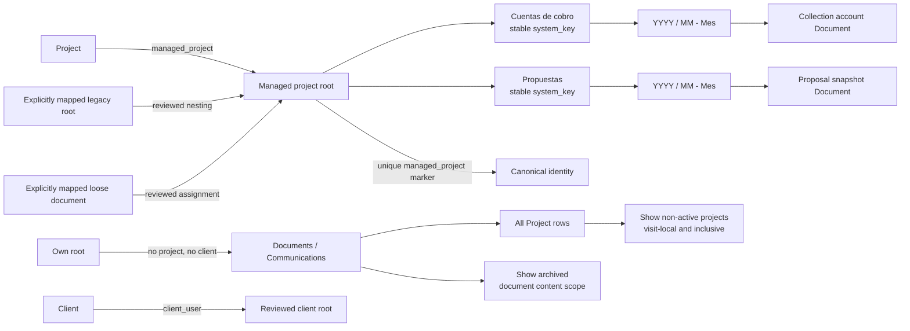

`Document.project` describes business ownership; `Document.folder` describes
where the record is stored. The entity sidebars list the complete canonical
project catalog even when a project has no root, documents or communications;
the managed
root remains the physical boundary for filing. Project lifecycle only chooses
whether a row belongs to the default operational catalog or to the optional,
inclusive non-active group; it never archives content. The independent archive
toggle changes document/folder scope. A reviewed client
root stays top-level with `client_user`; a reviewed related branch may be nested
under its canonical project root. A root with neither project nor client is the
only kind shown under Carpetas propias. Historical data enters these relations
only through the reviewed reconciliation manifest. Its v5 explicit document
directive can associate a loose record only when it has no folder/project and
its client is empty or matches; ordinary content enters the root and generated
content follows its keyed type/year/month path. Generated filing reuses the two keyed first-level categories and reparents any legacy keyed
branch before removing its now-empty parallel wrappers.

### 4.2 Model Details

| Model | Purpose | Key Fields |
|-------|---------|------------|
| **BusinessProposal** | Core proposal entity | uuid, title, **client (FK→accounts.UserProfile, PROTECT)**, client_name (snapshot), client_email (snapshot), client_phone (snapshot), status, total_investment, currency, language, show_contract_terms, contract_modality (`single` \| `split`), contract_params, expires_at, view_count, cached_heat_score, durable first-view notification status/attempts/timestamps/error. Snapshots are write-through, kept in sync via `proposal_client_service.sync_snapshot()`. |
| **ProposalSection** | Individual section within a proposal | proposal_fk, section_type (18 types — incl. `roi_projection`, web-only), title, order, is_enabled, content_json, is_wide_panel |
| **ProposalRequirementGroup** | Functional requirements group | proposal_fk, group_id, title, description, order |
| **ProposalRequirementItem** | Individual requirement item | group_fk, name, description, icon |
| **ProposalAlert** | Manual/auto alerts for sellers | proposal_fk, alert_type (including persistent `first_view`), message, alert_date, priority, is_dismissed |
| **ProposalViewEvent** | Each qualified browser session | proposal_fk, session_id, ip_address, user_agent, view_mode (`executive`/`detailed`/`technical`/`legal`), viewed_at, last_seen_at, finalized_at |
| **ProposalSectionView** | Per-section time tracking | view_event_fk, section_type, subsection_key (technical fragment or legal clause), time_spent_seconds, entered_at, view_mode |
| **ProposalChangeLog** | Full audit trail | proposal_fk, change_type (20 types), field_name, old_value, new_value |
| **ProposalShareLink** | Multi-stakeholder sharing | proposal_fk, uuid, shared_by_name, recipient_name, view_count |
| **ProposalDefaultConfig** | Default section templates per language | language (unique), sections_json |
| **DiagnosticDefaultConfig** | Per-language defaults applied at `WebAppDiagnostic` creation | language (unique), sections_json, payment_initial_pct (60), payment_final_pct (40), default_currency, default_investment_amount, default_duration_label, expiration_days, reminder_days, urgency_reminder_days. `clean()` enforces payment sum = 100. Read by `diagnostic_service.create_diagnostic` and surfaced through `/api/diagnostics/defaults/`. |
| **ProposalProjectStage** | Internal project execution tracking (Cronograma) — internal-only, gated by `is_admin` in serializer | proposal_fk, stage_key (`design`/`development`), order, start_date, end_date, completed_at, warning_sent_at, last_overdue_reminder_at |
| **EmailTemplateConfig** | Admin-editable email content | template_key (unique), content_overrides, is_active |
| **EmailLog** | Universal per-address outbound trace + grouped composed email history | proposal_fk, template_key, recipient, recipient_kind (to/cc/bcc), audience, status (including skipped), error_message, metadata (JSONField), delivery_id, delivery_role (primary/copy), snapshot (PROTECT) |
| **EmailDeliverySnapshot** | Immutable evidence captured before SMTP and shared by one visible delivery plus BCC attempts | delivery_id, template/family/classification, subject/from, to_recipients, cc_recipients, body (OneToOne/PROTECT), MIME and attachment byte totals, attachment count, captured_at, optional resend_of lineage |
| **EmailAttachmentSnapshot / EmailLinkSnapshot** | Exact sent files plus user-facing links | attachment file/filename/MIME/size/SHA-256/order/format/business kind, optional protected Document provenance and historical type; link URL/SHA-256 fingerprint/label/content-vs-template group/order. The full URL remains evidence while `(snapshot, url_sha256)` provides MySQL-safe uniqueness. |
| **EmailCopyRecipient** | Separate administrable BCC audience for every outbound email | email (unique), is_active, families (JSON list), created_at, updated_at |
| **Contact** | Contact form submissions | email, phone_number, subject, message, budget |
| **PortfolioWork** | Portfolio case studies | title_en/es, slug, cover_image, project_url, content_json_en/es, SEO fields |
| **BlogPost** | Blog articles | title_en/es, slug, cover_image, excerpt, content_json/html, category, author, SEO fields |
| **Document** | Generic branded PDF document (also the client signing portal source) | uuid, title, slug, is_client_visible, legacy status (expand/contract only), language (es/en), cover_type, content_json, private delivery copy, **requires_signature, signed_at, signed_by (FK→User), signature_name, signature_ip, signature_user_agent**, client_user/project/deliverable/folder FKs, created_at |
| **DocumentThread / DocumentThreadItem** | Internal linear history spanning document folders and organisational scopes | thread title and audit actors; one protected membership per document, chronology `occurred_on`, stable `position`, link/update actors and timestamps |
| **DocumentStateGroup / DocumentState** | Shared, scoped workflow catalog for documents and projects | catalog, group name/order/selection_mode; state name/normalized_name/slug/color/order/is_active/system_key/merged_into/incompatibilities/authors plus immutable project `operational_effect` and legacy read-only `show_in_document_manager` compatibility metadata; non-null `system_key` is database-unique per catalog and `NULL` remains repeatable |
| **DocumentStateEpisode / DocumentStateEpisodeEvent** | Canonical document/project workflow and append-only audit | exactly one of document/project, state, opened_at/closed_at, actors, outcome, close_note, origin; each opening/closing/removal/transition/merge/date correction has effective_at, recorded_at, actor and details |
| **DocumentNote** | Private normalized observation optionally linked to its originating episode | document, episode, title, content, order, open/resolved/discarded status, resolution_note, created/resolved actors and timestamps |
| **DocumentFolder / DocumentTag** | Folder hierarchy, system-owned project roots and legacy tag compatibility | name, color, parent (folder), client, project, optional one-to-one `managed_project`, nullable stable `system_key`, created_by; database checks keep a managed root active, top-level and aligned with its project |
| **CommunicationThread** | Client conversation container; separate from Document | client (PROTECT), optional project (SET_NULL), title, open/closed status, last_activity_at, closed_at, created/updated audit actors |
| **CommunicationMessage** | One ordered incoming/outgoing conversation event | thread, channel, direction, status, subject/content, occurred_at/recorded_at, source, reply_to, optional EmailLog seam, void audit |
| **CommunicationAttachment** | Bidirectional reference to an existing document | message (CASCADE), document (PROTECT), unique message/document pair |
| **CommunicationMessageRevision** | Append-only draft-edit audit | message, supplied field diffs, edited_by/at |
| **CommunicationMessageDateCorrection** | Append-only business-date correction | message, previous/corrected occurred_at, reason, corrected_by/at |
| **ContractTemplate** | Three default texts updated through one transactional service | combined/product/service Markdown, immutable ContractTemplateVersion history, ContractTemplateMirror documents/PDFs/sync dates; existing proposal files remain snapshots |
| **ProposalDocument** | Generated contracts and uploaded annexes of a proposal | proposal, document_type (`contract`, `contract_product`, `contract_service`, amendment, legal_annex, client_document, other), title, file, custom_type_label, is_generated, content_markdown (snapshot), timestamps |
| **CompanySettings** | Company-level branding and info used in PDFs | name, logo, address, tax_id, email, phone, website |
| **UserProfile** | Platform user (extends Django User) | user_fk, role (admin/client), company_name, phone, avatar, is_onboarded, profile_completed, **email_verified, email_verified_at**, document_navigation_mode (project/client panel preference), is_active |
| **VerificationCode** | OTP codes (login + email validation) | user_fk, code, purpose, expires_at, is_used |
| **SavedFilterTab** | Persisted admin filter tabs | user_fk, view, name, filters, base_filters, order |
| **Project** | Client project in platform with a real lifecycle | client_fk, name, description, current_state FK, state_review_required, compatibility status mirror (development/active/suspended/completed/decommissioned; archived only for legacy review), progress, dates, payment/hosting snapshots, production/staging/repository URLs and temporary legacy access fields |
| **ProjectAdminAccess** | One Django-admin credential set per fixed project environment | project_fk, unique environment (`production`/`staging`), admin_url, admin_username, admin_password_encrypted, updated_by and timestamps |
| **ProjectAccessNote** | Multiple encrypted operational notes per project | project_fk, title, content_encrypted, is_sensitive, created/updated actors and timestamps |
| **ProjectPhase** | Referencia comercial y de hosting | project_fk, business_proposal_fk (unique per project), order, hosting_start_date, hosting_activated_at |
| **ProjectContract / ContractAmendment** | Base contractual y sus modificaciones | project/contract FK, key, title, una fuente Document o ProposalDocument, client_visible, version |
| **DeliveryScope / DeliveryPhase / DeliveryStage** | Alcance, fases y etapas de entrega | contrato/otrosí, jerarquía, key/title, version; alcance vigente, referencia comercial opcional, estado editorial de etapa |
| **Requirement** | Guía comprobable por el cliente | stage FK, key, title, description, guide, order, version, review_status; proyecto derivado del contrato |
| **DeliveryPublication / RequirementReview** | Versión publicada y resultado recibido | ronda, contenido exacto, actor, decisión, versión revisada, fecha/autor originales y evidencia de origen |
| **DeliveryReviewDocumentEvidence** | Respaldo de la conformidad histórica, separado de la guía | revisión/documento protegidos, título y PDF privado exacto, huella; descarga autenticada del archivo registrado |
| **ContractSignatureEvidence / DeliveryDocumentLink / DeliveryDocumentSnapshot** | Firma y documentos por nivel | método portal/externo, PDF privado, huella y origen; asociaciones jerárquicas y copias publicadas |
| **DeliveryMessage / DeliveryWorkspace / DeliveryOperation** | Respuestas y control de escrituras | nivel, autor, requerimientos/documentos relacionados, nota interna; versión global y comprobante de reintento |
| **BugReport** | Reportes por proyecto | project FK, source_requirement FK nullable, title, description, status, severity, reported_by; fase de entrega derivada de la etapa fuente |
| **ChangeRequest** | Solicitudes por proyecto | project FK, source_requirement/linked_requirement FK nullable, title, description, status, created_by; conversión a guía pendiente en etapa editable |
| **Deliverable** | Project deliverables tracking | project_fk, title, description, status, due_date |
| **Notification** | In-platform notifications | user_fk, message, type, is_read, created_at |
| **HostingSubscription** | Hosting billing subscription | project_fk, plan (`quarterly`/`semiannual`/`nine_month`; legacy monthly/annual readable), status, start_date, billing amounts, next_billing_date |
| **Payment** | Payment milestones per project | project_fk, title, amount, status, due_date |
| **PaymentHistory** | Payment audit trail | payment_fk, event_type, amount, notes |
| **DataModelEntity** | Reusable JSON-defined data model schema | name, description, schema_json, created_at |
| **ProjectDataModelEntity** | Links a data model entity to a project | project_fk, data_model_entity_fk, custom_schema_json |
| **WebAppDiagnostic** | App-diagnostic entity (JSON-section architecture, mirrors BusinessProposal) | uuid, title, client snapshots, status, currency, investment, expires_at, view_count |
| **DiagnosticSection** | Section within a diagnostic | diagnostic_fk, section_type (8), content_json, visibility (initial/final/both), order |
| **DiagnosticChangeLog / DiagnosticViewEvent / DiagnosticSectionView** | Diagnostic audit + analytics | mirror the Proposal event/log models |
| **Task / TaskComment / TaskAlert** | Internal admin Kanban board (`/panel/tasks`) | status/priority TextChoices, position, assignee FK, due_date; comments + alerts |
| **IncomeRecord / ExpenseRecord / HostingRecord / RecurringPayment / AdsSpendRecord / PocketMovement** | Accounting ledgers (superuser) | via `PartnerSplitMixin`: ledger, date, total_amount, gustavo_amount, carlos_amount (company derived), source_ref (idempotency). Personal ledgers must be 100% the owner's (`clean()` invariant) |
| **CardBalanceSnapshot / AccountingChangeLog / AccountingSettings** | Accounting card-debt snapshots, audit trail, notification settings | weekly snapshots gate the card-debt reminder cron; settings hold recipients + toggles |
| **McpConnector** | Remote MCP connector (claude.ai) config | slug, name, is_active, token hash (SHA-256), tool catalog; plaintext token shown once |
| **McpRequestLog** | MCP endpoint activity feed | connector_fk, event (handshake/tool_call/auth_error/origin_rejected), created_at |
| **LinkedInToken** | Fernet-encrypted LinkedIn OAuth token (singleton) | access/refresh tokens, expiry |

---

## 5. Service Layer

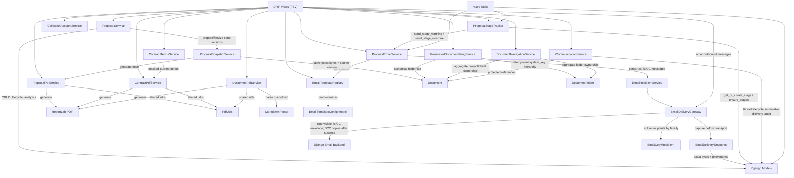

### Service Responsibilities

La vinculación de pagos Wompi se comprueba en
`accounts/services/wompi_payment_binding.py` antes de modificar un pago: ID de
transacción, importe en centavos, moneda COP y referencia de pago/proyecto o
`payment_link_id` local. Las respuestas de un cobro deben devolver su referencia
exacta; el polling conserva también el ID consultado. Verificación manual,
webhook, cobros con tarjeta y tareas comparten esta comprobación. El webhook
mantiene la firma y consulta la transacción canónica del proveedor antes de
resolver el pago. Una discrepancia conserva el pago y su historial; el alta de
una tarjeta ya verificada conserva sus datos aunque falle el cobro posterior.

| Service | Footprint | Responsibilities |
|---------|-----------|-----------------|
| **ProposalService** | Very large | Proposal CRUD, section management, default sections, analytics computation, engagement scoring, dashboard aggregation, CSV export, scorecard |
| **ProposalTrackingService** | Small | Atomic write-side contract for validated public heartbeats: session deduplication, section upserts, first-view state/alert, finalization, commercial signals and cached heat refresh. |
| **EmailRecipientService** | Small | Parses legacy singular or current array payloads, normalizes and validates visible To/CC recipients, rejects duplicates/placeholders and enforces the combined limit of 10; resolves registered-client ownership in one query for per-address history. |
| **ProposalEmailService** | Very large | All email sending: proposal sent (single + multi-proposal envelope), reminders, urgency, abandonment, revisit alerts, stakeholder alerts, engagement decay, post-expiration, branded + proposal composed emails, stage warning + stage overdue. Initial/resend flows pass a prepared snapshot to `_attach_commercial_pdf`, so the retained bytes and attached bytes are identical; the generation fallback remains for non-send compatibility callers. Shared helpers also include `_build_initial_email_context(proposal)` and `_send_stage_notification`. |
| **EmailDeliveryGateway** | Small | The only production owner of Django mail I/O. Requires every key in the universal inventory plus explicit client/internal/security classification, captures immutable To/CC headers plus body/link/attachment evidence before transport and blocks SMTP if archival fails, persists one row per address under one delivery, sends one visible primary envelope first, resolves segmented BCC recipients only after success, deduplicates all recipients, isolates copy failures and exposes one shared delivery trace/snapshot to `EmailLog`. |
| **OutboundEmailInventory** | Small | Authoritative mapping of all 56 outbound template keys to one of eight configurable copy families. Unknown keys fail closed; static tests reject mail calls outside the gateway. `ClientEmailInventory` remains the exact client-only compatibility subset. |
| **ProposalStageTracker** | Small | Day-by-day decision logic for project-stage email notifications. Holds the canonical `STAGE_DEFINITIONS` catalog (`design`, `development`), `ensure_stages` / `get_or_create_stage` helpers, `format_remaining_time(days)` (`"hoy"`, `"1 día"`, `"1 semana 5 días"`), and `process(proposal)` decision tree (70%-elapsed warning + every-3-days overdue reminders). |
| **ProposalPdfService** | Large | PDF generation with ReportLab: all 12 section types rendered to PDF |
| **ContractPdfService** | Medium | Contract PDF generation with contractor signature block, draft mode (no signature), Helvetica font, clickable TOC |
| **ContractTermsService** | Small | Resolves only the current default contract, applies draft masking through ContractPdfService, splits Markdown H2 clauses into stable anchors, and returns the public index/document payload. |
| **EmailTemplateRegistry** | Large | Centralized registry of all email templates with default content, admin-editable overrides, preview rendering, branded + proposal composed email entries |
| **PdfUtils** | Large | Shared PDF rendering utilities (fonts, colors, layout helpers) used by ProposalPdfService, ContractPdfService, and DocumentPdfService |
| **DocumentPdfService** | Medium | PDF generation for generic branded Documents with template-based rendering |
| **DocumentNavigationService** | Small | Builds active/archived project and client facets from canonical folder/document associations, including independent unassigned buckets and constant-query recursive inventory totals. |
| **DocumentThreadService** | Small | Atomically creates, updates and dissolves linear document histories; locks documents/memberships, enforces one thread per document and derives default chronology dates in Bogotá. |
| **GeneratedDocumentFilingService** | Small | Owns deterministic project/client/type/year/month paths, Spanish month names, stable folder keys, collection-account/proposal titles, cancellation branches and proposal-snapshot moves on onboarding. |
| **ProposalSnapshotService** | Small | Locks proposal rows, allocates monotonically increasing versions, renders every PDF before the first send, stores exact bytes and hash, files snapshots, and derives sent/needs-fix state from the delivery result. |
| **CommunicationService** | Small | Transactional thread/message lifecycle, direction/channel/state validation, document-reference validation, derived last activity, annulment and append-only date corrections |
| **MarkdownParser** | Small | Parses markdown content for Document PDF rendering |
| **CollectionAccountService** | Small | Collection account business logic |
| **CollectionAccountPdfService** | Small | PDF generation for collection account documents |
| **CollectionAccountSnapshotService** | Small | Owns immutable issue-time PDF storage, SHA-256/provenance, exact-byte reads, rollback compensation and email-first historical recovery. |
| **TechnicalDocumentPdf** | Medium | PDF generation for technical documents |
| **TechnicalDocumentFilter** | Small | Filtering logic for technical document modules |
| **PlatformOnboardingPdf** | Small | PDF generation for platform onboarding documents |

---

## 6. Frontend Architecture

### 6.0 Design System

Panel operational actions resolve through a semantic action catalog. Consumers keep handlers, routes, permissions and loading state locally; the catalog owns only the canonical Heroicons 24 Outline glyph and default Spanish label. `BaseActionIcon`, `BaseActionButton` and catalog-backed menus apply that metadata so icon changes remain one-place changes, while the panel action guard blocks local SVG/emoji drift and inaccessible icon-only controls in CI.

`BaseActionButton` also owns the complete tooltip boundary. Its visible
hover/focus hint defaults to the short catalog label, while the consumer-provided
`label` may retain row context as the accessible name. The wrapped `BaseButton`
disables native `title` forwarding, so browsers cannot render a second tooltip;
the application tooltip sizes to its short content up to one bounded maximum.
This shared boundary applies equally to document rows/cards and every other
panel consumer of the action primitive.

Control availability is also a design-system contract. `BaseButton`,
`BaseActionButton`, `BaseActionMenu`, `BaseSegmented` and
`BaseSegmentedMulti` accept a specific disabled reason. When the operator can
remove the block, `BaseControlGate` owns the focusable proxy around the native
disabled control, deduplicates and exposes every reason through adjacent live
copy plus hover/focus/touch help, and connects it with `aria-describedby`.
Busy-only states use `loading`; lifecycle, permission and ordering boundaries
use the same reason contract without pretending they are form errors. The
converse also holds: a field the operator still has to fill is not a blocker
for the gate. Submit stays available and `BaseFormField` names the requirement
beside its field after the attempt. The Documents create page and document
state catalog were aligned with this on 2026-09-26. The
strict `check-disabled-controls.mjs` scan protects all panel routes and reachable
module components in CI.

Responsive behavior is part of the design-system contract rather than a page-level exception. The canonical device profiles live in frontend configuration and cover 412, 835, 1195, 1440 and 2560 px widths. Shared navigation stays compact through portrait tablet, modal geometry is centralized in `BaseModal`, repeated tables declare business-priority columns, and the admin content column stops growing on large monitors.

Short interface controls are atomic by default. `BaseButton`, `BaseBadge`,
`BaseSegmented` and `BaseSegmentedMulti` keep text, count and icon together;
segmented groups may wrap between complete options while preserving equal-height
controls. `BaseModal` maps intent to one width contract (`confirm`, `form`,
`form-wide`, `wizard`, `detail`, `workspace`) instead of letting consumers tune
one-off sizes. Form columns converge through `BaseFormRow`: direct fields share
label/control/error bands, explanatory copy spans the complete group, and
`BaseFormRowAction` occupies the control band so a companion action is not
centred against the label and help block.

Semantic theme tokens live in `frontend/assets/styles/theme.css` and are exposed
as Tailwind colors (`bg-surface`, `text-text-default`, `border-input-border`,
etc.). Light/dark values flip with the `.dark` class on `<html>`, toggled by
`useDiagnosticDarkMode`. Base components in `frontend/components/base/`
(`BaseInput`, `BaseSelect`, `BaseTextarea`, `BaseButton`, `BaseBadge`,
`BaseCard`, `BaseDrawer`) wrap native HTML using these tokens, so consumer markup does not
need `dark:` variants. New views must prefer these tokens and components;
legacy code (with `bg-white dark:bg-gray-700` or `bg-esmerald` literals)
coexists and migrates incrementally. See
`frontend/components/base/README.md` for the full token table and migration
example. El contrato transversal de breakpoints, anchos máximos, tablas, tabs,
filtros, modales, formularios, acciones y workspaces está en el
[estándar responsivo del panel](../RESPONSIVE_STANDARD.md). Sus cinco viewports
de aceptación son obligatorios para todo cambio de UI bajo `/panel/**`.

Responsive behavior for the internal panel is a second design-system layer.
`frontend/config/responsive.js` is the single source for width bands and the
five reference viewports. Tailwind exposes those bands as namespaced
`panel-portrait`, `panel-landscape`, `panel-desktop` and `panel-wide` screens;
the names avoid Tailwind's built-in orientation variants. `BasePageShell`
enforces the 1400 px general-content ceiling, while `BaseResponsiveTable`,
`BaseExploratoryList`, `BaseResponsiveTabs`, `BaseFilterTabs`, `BaseModal`,
`BaseActionMenu` and `BaseBulkActionBar` own the recurring adaptations. Legacy
`AccountingTable`,
`BaseTabs` and `ProposalFilterTabs` are compatibility aliases over the shared
implementations so modules can migrate without an all-at-once rewrite.
Table sizing is a capability of that same layer: `BaseResizeHandle` owns the
separator interaction, `useResizableTableColumns` resolves persisted preferred
tracks against fixed columns and ordered donors, and `BaseResponsiveTable`
exposes the opt-in `columnWidth`/`columnWidthsKey` contract. `BaseOverflowText`
owns measured one/two-line clipping, remeasures after web fonts are ready, and
provides one conditional floating `BaseTooltip` plus the in-place touch
disclosure, so consumers do not duplicate tooltip or line-clamp heuristics. The
same viewport-aware tooltip primitive is teleported for `BaseActionButton`; that
component disables `BaseButton`'s native title so one control never emits two
competing notices. `BaseResizeHandle` exposes its accessible label as a native
hint so pointer users can discover the resize affordance. The Documents table
is the first specialized adopter and the folder-panel handle uses the same input
primitive. Its local column contract owns order, width and per-profile behavior
together: Actions → Title → States → Date → Client → Project. Landscape keeps
Actions plus the first three data tracks and groups Client/Project under Title;
desktop restores every data track without moving Actions from the leading
position. Three-dot row menus use the same explicit contract in
`BaseResponsiveTable` and `IncomeGroupedTable`: `rowActionsLayout="menu-start"`
places a fixed 3.5 rem control track after selection and before data, removes it
from proportional width allocation, and keeps the visual header empty while
retaining the accessible name. The default `inline-end` layout deliberately
preserves legacy loose-icon rows until those actions are consolidated into a
single menu; every accounting table and list was consolidated on 2026-09-26
(`AccountingRowActionsModal`, «Detalle e historial» first). A policy-driven
`menu-start` table emits `<col>` only for its control tracks, uses auto layout
with auto-width data columns below 1024 px and, from there, a fixed layout whose
header percentages are re-shared per profile among the visible columns.
Intrinsic text sizing is owned by the same layer. `tableLayout.js` resolves a
semantic `wrap`/`truncate`/`atomic` policy per column;
`BaseResponsiveTable` applies it to retained and grouped values, while
`BaseExploratoryList` applies it to its mutually exclusive table/card branches.
The safe data-owned default uses `min-w-0`, a bounded content box and
`overflow-wrap:anywhere`, so strings without spaces participate correctly in
min-content sizing. Badges inherit the same containment. A feature may truncate
only when it also owns a complete-value path. Document titles deliberately use
that exception: one-line ellipsis plus measured in-place disclosure, with folder
and other distinctions ordered in a separate wrapping metadata row.
`responsiveAcceptance.js` asigna cada vista del catálogo a uno de trece módulos.
Los PR ejecutan los módulos afectados en los cinco anchos; la matriz completa
corre mensualmente y bajo ejecución manual. La revisión semestral de los equipos
queda a cargo del equipo, sin creación automática de issues desde el retiro de
`standards-review` el 2026-09-23. El guion manual complementa la evidencia de CI.

Accounting is the reference adoption layer for those primitives. Its twelve
pages render through `BasePageShell`; `AccountingSubnav` and saved filters use
the shared compact navigation contract; `AccountingIndicatorGroup` preserves
business-ranked KPIs; and each `AccountingTable` column carries an explicit
`keep/group/hide` policy. Grouped-income and grouped-recurring headers own a
stacked compact representation. Pocket has one mutually exclusive structural
branch below 640 px: `PocketMovementCards` renders the same movement fields as
label/value facts, with concept and signed value first and the running balance
kept as **Saldo después** or **Acumulado filtrado**. From 640 px the declared
priority table returns. `PocketMovementRowActionsButton` feeds one
`PocketMovementActionsModal` from both branches, so edit/delete semantics do not
fork with layout. Incomes and Collection Accounts use the same leading menu in
their classic and grouped tables. Long modal flows declare a semantic `kind`,
and all compact badges use the atomic `BaseBadge` contract.

Indicator headers share `BaseIndicatorCard`. Its default stacked grid reserves
label, value and one optional support line even when the last row is empty. The
opt-in `compact-horizontal` layout instead keeps label and result/action on one
72–80 px row, omits an absent support row and gives help a dedicated 48 px grid
column. Help remains a sibling control and actionable cards expose one semantic
main button, avoiding nested interactive elements in both layouts. A bounded,
single-line support text may remain under the identity without increasing that
row. Projects uses the same compact layout and four/five-column grid for its
catalog-ordered non-zero lifecycle and operational cards on expanded screens;
below the landscape breakpoint one **Estados** summary and one **Pendientes**
summary open drawers with the complete facts. Incomes applies the same summary pattern as
**Resultado anual** plus **Detalle operativo**, while its expanded branch keeps
four business-ranked stacked cards. All branches reuse the same filter functions,
so layout changes presentation without forking behavior.

`BaseDrawer` is the shared transient second zone for compact panel views: it
teleports to `body`, traps focus, closes on backdrop/Escape, locks body scroll
and supports left/right/bottom placement. `BaseModal` keeps the Phase 1 semantic
size vocabulary and its canonical phone-fullscreen behavior; Phase 3 consumers
only provide scrollable bodies and sticky actions where their workflow needs it.

### 6.0.1 Responsive panel contract

| Viewport | Layout role | Documentos | Clientes | Proyectos |
|----------|-------------|------------|----------|-----------|
| 412×915 | Phone | Folder drawer + gallery | Filter/action drawers + stacked records | Two indicator summaries + one-column cards |
| 835×1194 | Portrait tablet | Folder drawer + two-column gallery | Same progressive filters + full KPI row | Two indicator summaries + two-column cards |
| 1195×835 | Landscape tablet | Two zones + prioritized table | Visible two-level filters | Sortable table |
| 1440×900 | Laptop | Full desktop information | Full desktop information | Full desktop information |
| 2560×1440 | Large monitor | 1400 px centered cap | 1400 px centered cap | 1400 px centered cap |

The compact decision comes from
`PANEL_BREAKPOINTS.landscape` in `frontend/config/responsive.js`, not a
collection of independent CSS hides. Each branch owns one interactive DOM so
drawers, rows and action menus are never duplicated for assistive technology or
Playwright. Data, filters and URL state stay in the existing stores/composables;
the responsive layer changes presentation only.

### 6.1 Page Routing

```mermaid
flowchart TD
    subgraph Public["Public Pages (SSR)"]
        Home["/"]
        Landing1["/landing-web-design"]
        Landing2["/landing-software"]
        Landing3["/landing-apps"]
        About["/about-us"]
        Portfolio["/portfolio-works"]
        PortfolioDetail["/portfolio-works/:slug"]
        Blog["/blog"]
        BlogDetail["/blog/:slug"]
        Contact["/contact"]
        ContactSuccess["/contact-success"]
    end

    subgraph SPA["SPA Pages"]
        Proposal["/proposal/:uuid"]
        Panel["/panel/ (Dashboard)"]
        PanelLogin["/panel/login"]
        ProposalsList["/panel/proposals"]
        ProposalCreate["/panel/proposals/create"]
        ProposalEdit["/panel/proposals/:id/edit (tabs: General, Correos, Documentos, Cronograma, Secciones, Det. técnico, Prompt, JSON, Actividad, Analytics)"]
        ProposalDefaults["/panel/proposals/defaults"]
        EmailTemplates["/panel/proposals/email-templates"]
        EmailDeliverability["/panel/proposals/email-deliverability"]
        BlogAdmin["/panel/blog"]
        BlogCreate["/panel/blog/create"]
        BlogEdit["/panel/blog/:id/edit"]
        BlogCalendar["/panel/blog/calendar"]
        PortfolioAdmin["/panel/portfolio"]
        PortfolioCreate["/panel/portfolio/create"]
        PortfolioEdit["/panel/portfolio/:id/edit"]
        Clients["/panel/clients"]
        Admins["/panel/admins"]
        DocumentsAdmin["/panel/documents"]
        DocumentCreate["/panel/documents/create"]
        DocumentEdit["/panel/documents/:id/edit"]
        CommunicationsAdmin["/panel/communications"]
        EmailsPage["/panel/emails"]
        ViewsPage["/panel/views"]
        TasksPage["/panel/tasks (internal Kanban)"]
        DiagnosticsAdmin["/panel/diagnostics + /create + /:id/edit + /defaults"]
        DefaultsPage["/panel/defaults (Propuesta / Diagnóstico)"]
        StyleguidePage["/panel/styleguide"]
        McpsPage["/panel/mcps (superuser)"]
        AccountingPage["/panel/accounting/* (superuser: incomes, expenses, recurring, cards, hostings, ads, pocket, history, settings)"]
    end

    subgraph Platform["Platform Pages (JWT Auth)"]
        PlatformLogin["/platform/login"]
        PlatformVerify["/platform/verify"]
        PlatformProfile["/platform/complete-profile"]
        PlatformDashboard["/platform/dashboard"]
        PlatformProjects["/platform/projects"]
        PlatformProjectDetail["/platform/projects/:id"]
        PlatformProjectDelivery["/platform/projects/:id/delivery"]
        PlatformProjectBugs["/platform/projects/:id/bugs"]
        PlatformProjectChanges["/platform/projects/:id/changes"]
        PlatformProjectDeliverables["/platform/projects/:id/deliverables"]
        PlatformProjectPayments["/platform/projects/:id/payments"]
        PlatformClients["/platform/clients"]
        PlatformClientDetail["/platform/clients/:id"]
        PlatformBugs["/platform/bugs"]
        PlatformChanges["/platform/changes"]
        PlatformDeliverables["/platform/deliverables"]
        PlatformNotifications["/platform/notifications"]
        PlatformPayments["/platform/payments"]
        PlatformCollectionAccountsPage["/platform/collection-accounts"]
        PlatformCollectionAccountDetail["/platform/collection-accounts/:id"]
        PlatformProjectCollectionAccounts["/platform/projects/:id/collection-accounts"]
        PlatformProjectDataModel["/platform/projects/:id/data-model"]
        PlatformDeliverableDetail["/platform/projects/:id/deliverables/:did"]
        PlatformProfilePage["/platform/profile"]
        PlatformAccess["/platform/projects/:id/access (admin-only)"]
        PlatformAccessLegacy["/platform/access (compatibility redirect)"]
        PlatformDocuments["/platform/documents (client document-signing portal — post-login landing for clients)"]
    end

    Panel -->|middleware: admin-auth| AuthCheck["/api/auth/check/"]
    PlatformDashboard -->|middleware: platform-auth| JWTCheck["JWT validation"]
```

### 6.1.1 View Map operational Explorer

`/panel/views` now has three views over two deliberately separate catalogs:

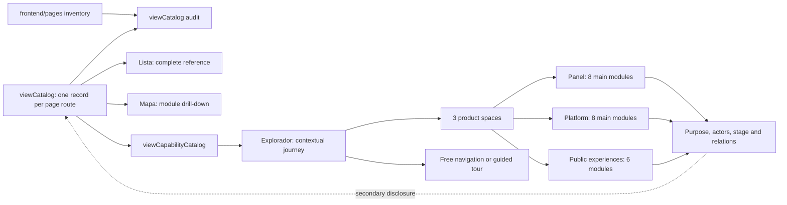

`viewCatalog.js` remains the canonical technical inventory. A CI scanner derives
routes from real page files and rejects missing, stale, duplicated or invalid
records. `viewCapabilityCatalog.js` is a curated operational projection: its
validator requires every catalog route and every technical section to belong to
exactly one product feature/space, while every relationship endpoint must exist.
The hierarchy starts with Panel interno, Plataforma de clientes and Experiencias
públicas; main modules lead to representative submodules and technical routes.

`ViewOperationalExplorer` has one semantic interaction model with two visual
branches: compact/portrait renders module cards, while landscape and wider
profiles render positioned buttons over a lightweight SVG relationship layer.
Hover or focus writes only an ephemeral preview into
`ViewExplorerContextPanel`; selection writes the stable node. Guided tours use
the main modules of one space as ordered steps, pause automatic rotation, and
are rendered by `ViewExplorerTourControls`. Mode, selected node, tour and
relation visibility are URL state (`viewMode`, `node`, `tour`, `relations`);
stopping a tour removes only `tour`, preserving `node`. Only the default mode is
persisted by `ViewMapSettings`. No live metrics or additional API are involved.

### 6.1.2 Client Chart Loading

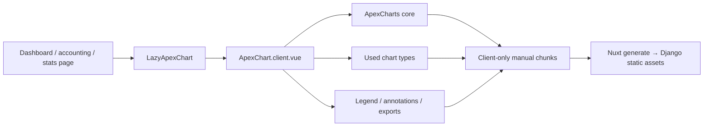

Charts are lazy and client-only: there is no global ApexCharts plugin in the Nuxt bootstrap. The wrapper owns the modular imports, while `vite.$client` splits ApexCharts and GSAP without changing Nitro's server graph. This keeps chart code away from routes that do not render charts and enforces the 500 KB client-chunk budget used by the production build.

### 6.2 Store Architecture

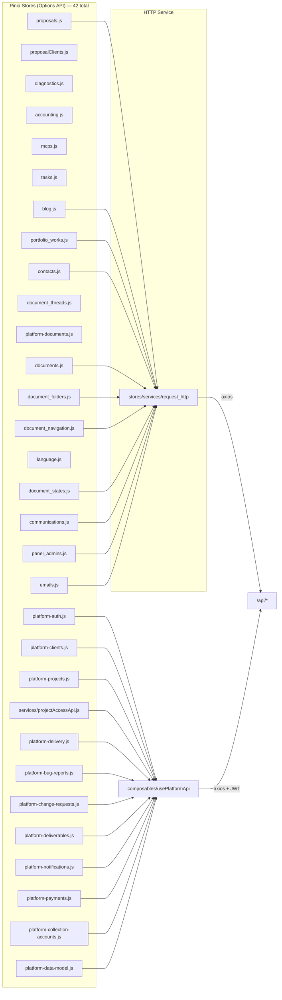

### 6.3 Proposal Admin List — Filters & Tabs

```mermaid
flowchart TD
    ProposalsList["pages/panel/proposals/index.vue"]
    ProposalsList --> ProposalStore["proposals.js (Pinia)"]
    ProposalsList --> useProposalFilters["useProposalFilters.js"]

    useProposalFilters --> FilterState["reactive currentFilters (11 dimensions)"]
    useProposalFilters --> TabState["savedTabs (localStorage + URL sync)"]
    useProposalFilters --> ApplyFilters["applyFilters() — single-pass client-side"]

    ProposalsList --> FilterTabs["ProposalFilterTabs.vue"]
    FilterTabs --> TabBar["Tab bar: Todas + saved tabs + '+' button"]
    FilterTabs --> TabActions["Rename / Delete context menu"]

    ProposalsList --> FilterPanel["ProposalFilterPanel.vue"]
    FilterPanel --> StatusPills["Status multi-select pills"]
    FilterPanel --> Dropdowns["Project type / Market type dropdowns"]
    FilterPanel --> Ranges["Investment / Heat score / View count ranges"]
    FilterPanel --> Dates["Created / Last activity date ranges"]
    FilterPanel --> Toggles["Currency / Language / Active status toggles"]
```

### 6.4 Proposal Client View Architecture

```mermaid
flowchart TD
    ProposalPage["pages/proposal/[uuid]/index.vue"]
    ProposalPage --> ProposalStore
    ProposalPage --> useProposalNavigation
    ProposalPage --> useExpirationTimer
    ProposalPage --> useProposalTracking
    ProposalPage --> useSectionAnimations
    ProposalPage --> GSAP["GSAP ScrollTrigger (horizontal scroll)"]

    ProposalPage --> Gateway["ProposalViewGateway: executive / detailed / technical / legal"]
    ProposalPage --> Sections["Section Components (18 section types; web-only types like roi_projection render here but skip the PDF)"]
    ProposalPage --> ContractTerms["Synthetic legal panels: overview/index → continuous contract"]
    ContractTerms --> ContractTermsAPI["GET /api/proposals/:uuid/contract-terms/"]
    ContractTerms --> ContractDraftAPI["GET /api/proposals/:uuid/contract/draft-pdf/"]
    Sections --> Greeting
    Sections --> ExecutiveSummary
    Sections --> ContextDiagnostic
    Sections --> ConversionStrategy
    Sections --> DesignUX
    Sections --> CreativeSupport
    Sections --> DevelopmentStages
    Sections --> FunctionalRequirements
    Sections --> Timeline
    Sections --> Investment
    Sections --> FinalNote

    NextStepsData["next_steps.content_json"] -->|steps + intro| FinalNote
    NextStepsData -->|CTA + contacts| ProposalClosing
    FinalNote --> KickoffColumns["Two columns: commitment + kickoff"]
    FinalNote --> KickoffDisclosure["Closed disclosure: schedule prerequisites"]

    ProposalPage --> ProposalClosing["Synthetic final closing panel"]

    FunctionalRequirements --> CoreRequirementCards["views · components · features · cross_cutting_features"]
    CoreRequirementCards --> ContextualQuality["Editable quality scope by business, stage and proposal"]
    FunctionalRequirements --> ItemRequirementsMap["item id → linked technical requirements"]
    ItemRequirementsMap --> LinkedRequirementsModal["Ver requerimientos (N)"]

    ProposalPage --> Overlays["Overlay Components"]
    Overlays --> ProposalIndex
    Overlays --> SectionCounter
    Overlays --> ExpirationBadge
    Overlays --> PdfDownloadButton
    Overlays --> ShareProposalButton
    Overlays --> ProposalExpired
```

`next_steps` is data-only in the public route: it is not rendered as an independent horizontal panel. Its prerequisite steps are merged into `FinalNote`, while commercial calls to action and contact channels are passed to the synthetic `ProposalClosing` panel in detailed, executive and technical modes. This keeps the commitment narrative distinct from the final response/contact surface.

Commercial item traceability is inclusion-aware. Visible base groups always require coverage; calculator modules require it only when selected/default-selected, and hidden groups are ignored. `TechnicalDocumentEditor` blocks saving when an included item has no technical requirement in `linked_item_ids`, but reports unselected optional gaps as non-blocking warnings. The same mapping powers the client-facing “Ver requerimientos (N)” link for base and contracted-module cards.

The functional-requirements JSON starts with four core presentation groups in a
stable order: `views`, `components`, `features`, and
`cross_cutting_features`. The latter is a required container but not fixed
content: proposal generation adapts its quality items to the business, stage,
audience and actual scope. Every retained item receives a stable id and the
technical prompt creates the matching epic plus `linked_item_ids`; PDF rendering,
the proposal module catalog and proposal→project scope synchronization consume
all groups generically. Migration `content.0222` inserts the group into stored
defaults and active draft snapshots, moves the legacy responsive item without
changing its id, and deliberately leaves historical proposals untouched.

---

## 7. Async Task Architecture

```mermaid
flowchart TD
    subgraph Triggers["Task Triggers"]
        SendAction["Admin: Send Proposal"]
        DailyCron["Daily Cron (midnight)"]
        TrackEndpoint["Client: Track Engagement"]
    end

    subgraph HueyTasks["Huey Tasks"]
        SendReminder["send_proposal_reminder"]
        SendUrgency["send_urgency_reminder"]
        ExpireStale["expire_stale_proposals (periodic)"]
        SendAbandon["send_abandonment_email"]
        SendRevisit["send_revisit_alert"]
        SendInvestment["send_investment_interest_email"]
        SendStakeholder["send_stakeholder_alert"]
        SendPostExpiry["send_post_expiration_alert"]
        SendEngagementDecay["send_engagement_decay_alert"]
        SendCalcFollowup["send_calculator_followup"]
        RefreshHeatScores["refresh_all_heat_scores (periodic)"]
        AutoArchive["auto_archive_stale_proposals (periodic)"]
        StageDeadlines["notify_proposal_stage_deadlines (periodic — daily 13:30 UTC = 08:30 Bogotá)"]
        AutoChargeSubs["auto_charge_due_subscriptions (periodic — daily 06:00; stored-card hosting billing + prorated phase onboarding)"]
        CardDebtReminder["send_card_debt_reminder (periodic — Fridays; accounting card-debt, re-alerts every 2 days until a snapshot clears the cycle)"]
        ReconcileRebuild["reconcile_frontend_rebuild_request (periodic — 02:30; re-requests a stale prerender, never builds)"]
        RebuildPrerender["rebuild_frontend_prerender (FRONTEND_REBUILD_MODE=inline, local dev only; @lock_task 'frontend-rebuild', retries=2)"]
    end

    subgraph MoreTriggers["More Triggers"]
        BlogPublish["Blog, additional-modules, explainer-video, video-resource or Partnership Program change"]
    end

    SendAction -->|schedule delay| SendReminder
    SendAction -->|schedule delay| SendUrgency
    DailyCron --> ExpireStale
    DailyCron --> RefreshHeatScores
    DailyCron --> AutoArchive
    DailyCron --> StageDeadlines
    DailyCron --> AutoChargeSubs
    DailyCron --> CardDebtReminder
    DailyCron --> ReconcileRebuild
    BlogPublish -->|"request mode (production)"| RebuildRequest["backend/logs/frontend-rebuild-request.json → ops toolkit regenerates"]
    ReconcileRebuild -->|stale prerender| RebuildRequest
    BlogPublish -->|"inline mode: coalesced 120s"| RebuildPrerender
    TrackEndpoint -->|conditional| SendAbandon
    TrackEndpoint -->|conditional| SendRevisit
    TrackEndpoint -->|conditional| SendInvestment
    TrackEndpoint -->|conditional| SendStakeholder
    TrackEndpoint -->|conditional| SendPostExpiry
    TrackEndpoint -->|conditional| SendEngagementDecay
    TrackEndpoint -->|conditional| SendCalcFollowup
    StageDeadlines -->|via ProposalStageTracker.process| HueyTasksOut["send_stage_warning / send_stage_overdue (internal team)"]
```

---

## 8. Deployment Architecture

```
Client (HTTPS)
    │
    ▼
Nginx (SSL termination, Let's Encrypt)
    ├── /static/  → backend/staticfiles/
    ├── /media/   → backend/media/
    └── /*        → unix:/run/projectapp.sock
                        │
                        ▼
                   Gunicorn (2 workers)
                        │
                        ▼
                   Django (settings_prod)
                   ├── /api/*     → DRF views
                   ├── /admin/*   → Django admin
                   └── /*         → serve_nuxt (pre-rendered Nuxt pages)

Systemd Services:
  - projectapp.service  → Gunicorn (via projectapp.socket)
  - projectapp-huey     → Huey worker

Redis:
  - redis://localhost:6379/5  → Huey task queue

MySQL:
  - localhost:3306  → projectapp_db
```

### Production Build Flow

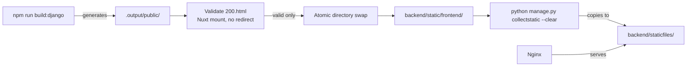

Nuxt payload data stays inline because the generated site is mounted below `app.cdnURL=/static/frontend/`; external `_payload.json` URLs are not part of this deployment topology. Private routes are deliberately not prerendered and therefore depend on the root `200.html` SPA shell. The build refuses to publish a fallback that is empty, redirects, or lacks `#__nuxt`. Django owns the locale redirect for the bare root through the preferred-locale cookie and nginx country header; Nuxt browser-language detection stays disabled so it cannot rewrite the unprefixed fallback. Clearing `staticfiles/` on every deploy and prerender regeneration prevents old content-hashed chunks and file/directory collisions from surviving publication.

---

## 9. Current Workflow

### Proposal Creation → Client View → Close

The explicit `$proposal-create` / `/proposal-create` workflow can precede the panel: it asks for unresolved commercial decisions, exports active defaults, produces and audits JSON + a decision manifest, then—only after a separate approval—creates an unsent draft through the same serializer/service used by JSON import.

1. Admin creates proposal via `/panel/proposals/create` (or JSON import)
2. Admin selects an existing client from `<ClientAutocomplete>` (or types a new one). Backend resolves the client via `proposal_client_service.get_or_create_client_for_proposal()` — case-insensitive dedup by `User.email`, never hijacks admin accounts. Empty emails get a placeholder `cliente_<id>@temp.example.com` (RFC 2606 reserved TLD) generated via two-step save, which automatically pauses every email automation for that proposal until a real address is entered.
3. 18 section types auto-generated with default content per language (some web-only, skipping the PDF). Functional requirements begin with the four core cards `views` → `components` → `features` → `cross_cutting_features`; the fourth container is stable while its quality items are contextual. The frontend seller prompt and backend `_seller_prompt.bold_formatting` share the same 14-field lead-copy emphasis contract; both must remain aligned. `show_contract_terms` remains separate top-level metadata, so enabling the fourth reading mode does not mutate this section snapshot or its prompt/JSON shape.
4. Admin edits sections via `/panel/proposals/{id}/edit`. Proyecto > Datos owns client selection, editable contact snapshots and the current project in all statuses. A linked proposal cannot swap its client through a generic PATCH. Contact and email settings save independently of the General draft; Recursos lives under Propuesta. Changing a linked project uses an audited preview/confirm operation within the same client.
5. Admin clicks "Send" → email sent to client + admin notification + reminders scheduled (skipped silently if client email is a placeholder)
6. Client opens unique link `/proposal/{uuid}`; this document `GET` does not count as a commercial view, and staff sessions or drafts never enter tracking.
7. The gateway offers executive, detailed and technical views; eligible Spanish proposals also offer **Contrato y condiciones**. That legal mode lazily loads the current masked global template into a full-content-width intro/index panel followed by one continuous vertical contract panel contained in one semantic, accessible paper surface. PDF download remains a persistent floating proposal action and is not duplicated inside the introduction.
8. After five visible seconds the browser sends the first validated heartbeat; subsequent 30-second heartbeats update the same session and hide/unload sends a final beacon. The transaction records section time, reading mode and active technical fragment or legal clause in `subsection_key` without double-counting the session.
9. The first qualified view creates a persistent panel alert and durable email delivery state. Huey retries transport failures and a five-minute reconciler recovers pending/failed/stale claims; historical unverified views never generate retroactive mail. Other automated emails continue based on behavior — every client-facing send checks `_is_unsendable_client_email()` first, so placeholder accounts never receive mail.
10. Client responds: accept / reject (with reason) / negotiate / comment. Acceptance fires `ProposalEmailService.send_acceptance_confirmation()` to the client (this branch was added 2026-04-09 — see ERR-007).
11. Admin monitors via dashboard, alerts, analytics, scorecard. Orphan clients (zero proposals, zero projects) can be cleaned up from `/panel/clients` Huérfanos tab.

### Hosting Terms → Public Snapshot → Operational Billing

1. `BusinessProposal` and `ProposalDefaultConfig` own the 9/6/3-month discounts; `ProposalSection.content_json.hostingPlan` mirrors their presentation.
2. `normalize_hosting_plan()` enforces the current catalog for active draft/sent/viewed/negotiating/expired proposals, so the public serializer and `ProposalPdfService` calculate from one shape.
3. Closed or inactive proposals keep their stored tiers for contractual history. Platform onboarding explicitly requests current terms when it turns an accepted proposal into a new `Project` snapshot.
4. Current `HostingSubscription` and active accounting `HostingRecord` rows use `nine_month`; cancelled/archived subscriptions, paid `Payment`/`HostingCycle` rows and inactive records retain legacy values and historical labels.
5. Data migrations abort before changing a subscription when an unpaid annual payment is processing or already linked to Wompi; safe pending payments are recalculated to nine months.

### Recurring Inputs → Canonical COP Projections → Budget Totals

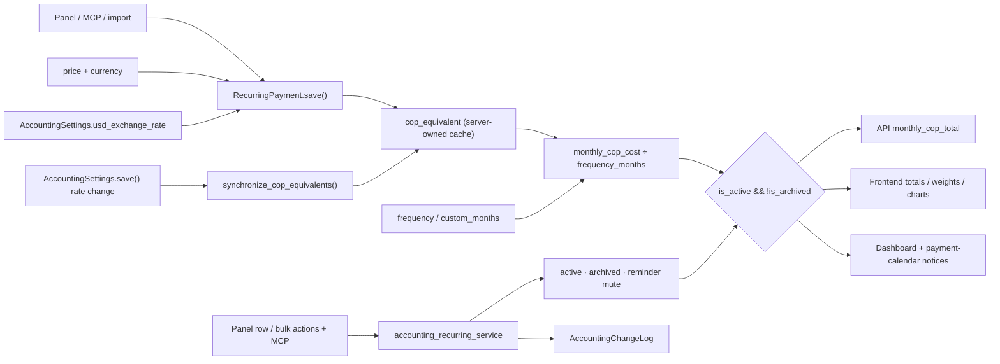

The configured rate is a current-rate policy, not a historical snapshot. A settings-rate change updates every stored USD equivalent atomically; ordinary recurring writes derive their own equivalent and ignore client-supplied cache values. The API then serializes the refreshed monthly projection, so the general total and the frontend category sums consume the same canonical rows. Migration `content.0208` performs the one-time historical repair.

Lifecycle is a separate service boundary. `accounting_recurring_service` owns state, archive/restore, reminder mute, duplicate drafts and transaction-locked bulk writes; the panel endpoints and six accounting MCP tools converge there and audit every changed row without sending accounting-change email noise. List/export scope is explicit (`archive_scope=current|archived|all`), restore is inactive by construction, and hard delete is rejected until archive. Migration `content.0219_recurring_lifecycle` adds the archive and mute state. A duplicate endpoint returns form seed data only: the ordinary create path remains the sole writer. No edge in this graph creates an `ExpenseRecord` or `PocketMovement`; registering a period charge is intentionally a later ledger-origin architecture.

### Collection Accounts → Grouped Receivables View

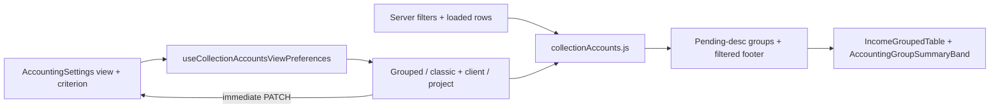

The collection list endpoint remains the row source; grouping and aggregation are
deterministic presentation logic over the filtered result. One utility owns the
money contract: issued includes issued + paid, pending includes issued, collected
includes paid, cancelled includes cancelled, and drafts contribute no money. Its
status breakdown is separate, with overdue derived from an issued row's due date
and therefore intentionally overlapping the issued count. Project keys prefer the
live relation, preserve a different historical snapshot as `<name> (histórico)`,
and reserve a final unassigned group for a genuinely absent project. The global
settings row persists both controls together; an optimistic save rolls the UI back
when the PATCH fails.

### Document → Independent Thread → Linear Chronology

```mermaid
flowchart LR
    Source["Document action / editor"] --> Modal["Thread workspace"]
    Modal --> Search["Cross-folder candidate search"]
    Search --> Service["DocumentThreadService · atomic locks"]
    Service --> Thread["DocumentThread"]
    Thread --> Items["DocumentThreadItem · one per document"]
    Items --> Date["issue_date or Bogotá created date"]
    Date --> Stable["occurred_on + position"]
    Stable --> Timeline["Linear chronology"]
    Archive["Archive document"] -->|membership preserved| Timeline
    Delete["Delete document"] -->|PROTECT / HTTP 409| Unlink["Unlink first"]
    Unlink -->|one member remains| Dissolve["Dissolve thread"]
```

The relationship is orthogonal to `DocumentFolder`, client and project FKs.
`DocumentThreadItem.document` is a protected one-to-one seam, so concurrent
writers cannot place one document in two histories and deletion cannot silently
break a thread. REST views remain thin FBVs over the transactional service. The
Pinia store rejects stale thread and candidate responses; the modal rejects stale
detail responses, while the shared PDF
pane does the same for availability probes. The modal is the only management
surface, while list/detail serializers expose only a compact `thread_summary`.
The MCP registry classifies both models as deliberately panel-only.

### Document Event → Episode → Current State

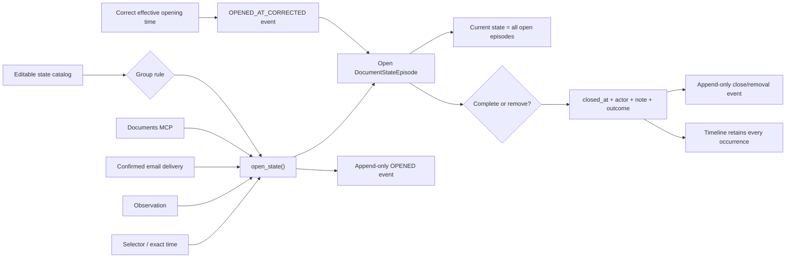

`document_state_service` is the only workflow writer and locks the document before
enforcing exclusivity, declared incompatibilities and repeatability. The document-
local episode event stream is the canonical audit for state changes; generic history
does not duplicate those movements. Catalog renames preserve stable integration keys,
and merging retires the source while keeping historical meaning and merge events.
`document_note_service` owns note linkage and only closes needs-fix after the final
undeleted open linked observation is resolved, discarded or deleted. Client visibility
is orthogonal and never derived from an episode.

### Observation Decision → Recoverable Trash → State Reconciliation

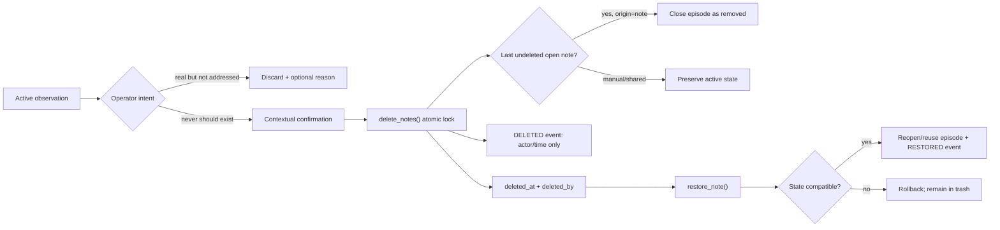

`DocumentNote.deleted_at/deleted_by` is the recoverable record; default document,
history and episode serializers exclude it. `DocumentNoteEvent` is append-only and
deliberately omits content snapshots. REST and the Documents MCP converge on the
same locked service, including one-document bulk validation and automatic state
coherence. The note manager renders active, trash and activity panes inside the
existing `BaseModal`; destructive confirmation is an internal state of that dialog,
so no nested browser prompt or one-click list deletion exists.

Panel dialog policy is enforced separately from individual consumers: confirmations
and text capture use `BaseModal`/`ConfirmModal`, errors remain inline/actionable, and
`check-panel-native-dialogs.mjs` scans every reachable panel page/component in CI.

### Project State Preview → Consequences → Episode

```mermaid
flowchart LR
    Catalog["Shared catalog · projects"] --> Preview["preview_transition()"]
    Financial["Open incomes, payments, hosting"] --> Preview
    Preview --> Token["Impact + SHA-256 token"]
    Token --> Decision{"Operator confirms"}
    Decision -->|Evolve| Continue["Keep operating/billing; record the new lifecycle meaning"]
    Decision -->|Suspend| Stop["Stop new billing/reminders; keep caused debt"]
    Decision -->|Complete| Clean["Require clean financial close"]
    Decision -->|Decommission| Final["Cancel future service + resolve each debt"]
    Stop --> Episode["Close prior + open dated episode"]
    Clean --> Episode
    Final --> Episode
    Changed["Financial state changed"] --> Reject["409 stale preview; no write"]
```

`project_state_service` is the only lifecycle writer. It locks the project and
financial rows, recalculates the impact token and applies consequences atomically.
The editable label never drives behavior: `DocumentState.operational_effect` does.
`DocumentState.description` is editable explanatory copy, while
`operational_effect_help` is derived from that immutable effect so a rename cannot
misrepresent billing or closure consequences. `ProjectStateHelpBadge` renders both
layers throughout the internal Projects panel. **Activo** and **En evolución** are
distinct catalog meanings that deliberately share the `operating` effect.
The catalog's input-validation boundary is separate from those semantic help
layers: `BaseFormField` presents attempted local/API errors beside create, edit and
merge controls, while `BaseControlGate` is reserved for permanent restrictions
such as seed-state merges. This keeps actionable corrections attached to their
input without turning immutable policy into a red validation list.
The legacy `Project.status` remains a compatibility mirror, while new panel and
platform writes cannot mutate it directly. Hosting failure produces a manual
suggestion only; no timer automatically moves Suspendido to Dado de baja.

### Client Communication Scope → Manual Fact → Reply Context

```mermaid
flowchart LR
    Managers["Panel + MCP"] --> Thread
    Thread["Client thread + optional project"] --> Draft["Outgoing draft"]
    Thread --> Lifecycle["Edit · close/reopen · archive/restore"]
    Draft --> Copy["Operator copies/sends outside ProjectApp"]
    Draft --> Delete["Delete active draft"]
    Copy --> Sent["Mark sent with occurred_at"]
    Sent --> Reply["Register incoming reply_to"]
    Reply --> Responded["UI derives Respondido"]
    Documents["Existing Documents"] -->|protected references| Draft
    Sent --> Correction["Append-only date correction"]
    Sent --> Void["Annul with reason"]
```

The registry is deliberately not a transport. A manual source records the
operator's assertion that a message was sent; it never impersonates an SMTP or
WhatsApp delivery receipt. This is the chosen workflow, so the interface does
not present automatic delivery as a pending phase. Historical conversations
keep their original client: when a project changes owner, its threads are
detached from the project rather than reassigned.

Panel and MCP share `communication_service.py` as the only write boundary. MCP
exposes lifecycle verbs instead of writable state flags: thread archive fields
remain read-only in the generic model contract, historical messages can only be
annulled or date-corrected, and only active outgoing drafts can be edited or
deleted. The connector therefore reaches panel parity without acquiring a
lower-level bypass around transition or audit rules.

Read navigation has one shared boundary. The panel sends its project/client
selection, multi-value filters and order to `communication_query_service`; the
REST view returns both rows and facets, while the MCP scalar inputs are normalized
through the same parser. Its text query covers thread title, client, project name,
message subject and content. Filters within one dimension are OR and dimensions
are AND. Channel, direction, message status and date are correlated against one
message instead of being satisfied by unrelated messages in the same thread.
The list URL owns that state and `thread=<id>` opens the selected conversation in
a workspace modal, preserving the list when the modal closes or browser Back is
used.

The same boundary drives the quick-filter strip. Factory filter definitions are
immutable application configuration; each user's `SavedFilterTab` builtin rows
persist only order and visibility, while custom rows persist the user's own
criteria. The panel sends all visible tab specifications to one bounded
full-dataset count endpoint, so selecting one cut never corrupts the counts of
the others. Reset deletes and reseeds only factory placeholders, preserving and
renumbering custom views. This separation lets factory and user tabs share
`BaseFilterTabs` overflow/reorder behavior without confusing ownership.

### Modal-Owned Selector Surfaces

`BaseFloatingListbox` is the shared rendering boundary for searchable selectors
inside `BaseModal`. The modal provides a dedicated floating root outside its
overflow panel; listboxes teleport there, position themselves against their
input, clamp to the viewport and flip above when that side has more room. The
same modal context registers open floating layers so the panel stays fixed while
the list owns any result overflow. The dialog-level focus trap includes the
teleported options, while Escape closes the list before it can close the modal.

`ClientAutocomplete`, `ProjectSelect`, `ProjectCatalogSelect`,
`DocumentFolderSelect` and the linked-income selector in
`CollectionAccountFormModal` consume that primitive. This keeps accounting and
Documents modals on one clipping, focus and scroll contract instead of
repeating per-screen absolute dropdown workarounds.

`DocumentFolderSelect` (document create and edit) filters the folder tree the
page already loaded: each row shows location · owner · non-active project
state because folder names repeat by design, and system-managed folders are
never offered since `create_document_from_markdown` rejects them with 409. Its
pure helpers live in `utils/folderOptions.js` and read the store's raw list, so
a row without `parent` or a non-list payload cannot break the form.

The same selector can expose two rendering surfaces without duplicating its data
state. `ClientAutocompleteResults` owns client identity, loading, retry, empty
and progressive-page states. The default `floating` presentation wraps it in
`BaseFloatingListbox` for secondary form choices. The explicit `catalog`
presentation keeps the same results permanently in document flow; only
`BulkAssignModal` opts into it because client selection is that dialog's main
decision. The modal therefore reserves no overlay height and the catalog owns
the sole overflow region while count, affected identities and actions remain
still. Project assignment and the selectors in Documents/cuenta de cobro retain
their floating behavior.

Geometry, ordering and data readiness are separate parts of that contract.
`ClientAutocomplete` requests the empty query when an active catalog opens (or
when an uncommitted floating picker gains focus). `search_proposal_clients`
orders by the display-name fallback (person name → company → email), accepts
`order=name|-name`, returns at most 20 rows for `limit`/`offset`, and keeps its
historical array body while publishing the filtered total in `X-Total-Count`.
The catalog defaults to A-Z and persists its A-Z/Z-A choice under a consumer-
owned browser key. Scroll-end appends the next page without duplicates and keeps
the requested order. Empty and failed reads remain actionable in either surface.

The linked-income selector owns a stable view-state default rather than a
server restriction: it fetches the eligible expected/liquid pool, scopes it to
the selected client and selects `IncomeRecord.kind === 'expected'` on open and
client change. Payment status is deliberately outside this filter, preserving
partially paid projections. Its empty-state action widens kind before scope, so
the normal escape hatch keeps the selected client; no selection is persisted.

### Representative Fake Data → Coherent Cross-Module Graph

```mermaid
flowchart TD
    Guard["FAKE_DATA_ALLOWED is literally true"] --> Atomic["One outer transaction"]
    Atomic --> Identity["Platform identities + 60-client skew"]
    Identity --> Content["Proposals, blog, portfolio, tasks, diagnostics"]
    Identity --> Platform["Heavy project: 60 requirements/deliverables/changes/bugs"]
    Platform --> Accounting["Accounting + dated hosting"]
    Accounting --> Documents["IncomeRecord → collection-account service"]
    Documents --> Communications["Client threads + protected document references"]
    Communications --> Auxiliary["Email, QR, Linktree, LinkedIn, MCP history"]
    Auxiliary --> Commit{Every stage succeeded?}
    Commit -->|yes| Dataset["Commit complete dataset"]
    Commit -->|no| Rollback["Rollback every stage + non-zero exit"]
```

`content.fake_data.SeedContext` derives an isolated deterministic stream for
each namespace from one seed and provides a shared aware noon anchored to an
explicit business date. Child commands enforce the guard independently, so
calling a seeder directly cannot bypass the production stop. The orchestrator
orders accounting before documents because collection accounts are created by
the real income-backed service, and orders documents before communications so
messages can reference only documents belonging to the thread's client.

The concrete-model registry is an architectural dependency check: every
`accounts`/`content` model must be classified as seeded, derived, catalog or
explicitly exempt. The focused contract test compares that inventory with
Django's app registry and fails when a new model has no declared fake-data
owner.

### Proposal Personalized Send Message

`BusinessProposal.email_intro` is the shared boundary for manual and generated
copy. Proposal-create artifacts carry it under
`_meta.optional_metadata.email_intro`; the JSON create UI and MCP adapter flatten
that metadata into the serializer field, and the **Correos** tab edits the same
value independently from the general form. The list serializer exposes it so
list-level send and bulk-resend guards do not need another detail request.

The write boundary deliberately separates draft validity from action validity.
A draft can exist with an empty message, but `ProposalService` checks the
trimmed field at the start of initial send, resend and multi-send. A resend may
accept an edited value, but validates it before replacing the stored value; a
multi-send validates the complete set before creating any snapshot or changing
any proposal. UI scorecards and disabled actions are guidance, while this
service check is the authority for panel, REST and MCP callers.

`ProposalEmailService` resolves the predefined template body independently and
then renders body → personalized message → commercial blocks in both HTML and
text templates. Delivery snapshots store the final rendered body, so editing
`email_intro` after delivery changes only future sends and never rewrites the
historical record.


## Formalización de propuestas

Los endpoints administrativos `proposals/{id}/formalization/` delegan en un servicio independiente. `FormalContent` captura las secciones originales habilitadas. `formalization_pdf` invoca los generadores originales sin contexto de reescritura: el comercial conserva los diez capítulos acordados, ordenados por tipo por `proposal_pdf_sections`, y el técnico sólo `stack`, `dataModel` y `epics`, después del filtro normal de selección. Los dos PDF comerciales tienen orden fijo independiente de la web; encabezados, subsecciones e índice se numeran según contenido visible. Los generadores ajustan el inicio del contenido a las páginas reales de presentación e índice, con enlaces por página del índice. El detalle técnico público sigue completo. `proposal_pdf_layout` comparte entre ambos generadores las medidas de filas, badges y párrafos: reserva real de prioridad, tablas compactas, márgenes exteriores y continuidad paginada. Los parámetros de saltos de párrafo de `pdf_utils` son optativos para conservar otros tipos de PDF. Las condiciones comerciales siguen las reglas originales del catálogo; Markdown extrae texto del PDF generado. Las preparaciones con anexos anteriores a esta versión requieren revisión nueva, sin modificar sus archivos ni los envíos históricos. Una preparación privada conserva payload, HTML/texto, huella de origen y bytes de adjuntos por 24 horas. El envío reclama la preparación mediante actualización condicional de estado y entrega esos mismos bytes al gateway existente, que conserva snapshots e historial. El envío no cambia el estado comercial. Los archivos temporales se eliminan por tarea diaria y también al borrar su propuesta.

En modalidad separada, `proposal_hosting_terms` resuelve los importes y el
contenido de hosting compartidos por PDF y contrato. El anexo comercial pasa
`include_hosting=False`; `resolve_contract_content` incorpora las condiciones al
servicio estándar o personalizado y guarda el mismo snapshot que se renderiza.
`service_contract_freshness` compara ese texto durante negociación, sin escribir
documentos al consultar. La lista calcula un snapshot por propuesta y entrega
`needs_regeneration` a las filas; la formalización bloquea el servicio obsoleto.
La huella de origen incluye los tres descuentos. No se reescriben paquetes
preparados ni contratos de propuestas cerradas.


### Modalidad de cierre

`BusinessProposal.contract_modality` decide si el negocio cierra con el contrato único o con dos documentos:
- el contrato de producto, `product_content_markdown`;
- el contrato de servicio, `service_content_markdown`.

`content/services/contract_variants.py` registra las tres variantes, sus claves de `contract_params`, portadas y tipos de documento. `proposal_contract_modality` planifica y aplica la transición en cualquier estado. El PATCH conserva el cambio directo durante negociación; los demás estados requieren nota e intención de diez minutos mediante preview/confirm/cancel. Los personalizados se trasladan literalmente con su PDF. Las instantáneas permanentes conservan parámetros y Markdown en JSON y copias PDF inmutables en la base de datos; restaurar es otra operación confirmada. Las filas anteriores de ProposalDocument quedan archivadas sin borrar archivos ni vínculos históricos. MCP utiliza el mismo servicio y McpActionIntent.

Los cambios de modalidad no modifican plantillas ni sus espejos globales. Los tres plazos del servicio se exigen explícitamente para split; el resultado y el historial identifican fuentes y documentos históricos sin sustituir documentos firmados.

Descargas, copia Markdown, adjuntos del compositor, envío legado, formalización, regeneración y sincronización con la plataforma usan sólo los documentos de la modalidad activa.

### Carpetas independientes de comunicaciones

`CommunicationFolder` guarda un árbol por perfil de cliente y proyecto opcional, separado de `DocumentFolder`. `CommunicationThread.folder` organiza el hilo completo. Los servicios REST/MCP validan contexto y ciclos bajo un lock del perfil del cliente; el FK PROTECT evita borrar carpetas con hilos, incluso archivados. Las comunicaciones madre no se mueven. La navegación persiste `folder=<id>|none` y la búsqueda textual/ID recorre todas las carpetas dentro del contexto seleccionado.


### Organización documental REST/MCP — 2026-09-28

Las escrituras comparten el resumen de `document_write_service`, separado del
serializer de detalle. `include_content` se valida antes de cualquier escritura.
El movimiento masivo usa `document_move_service`: bloquea documentos en orden,
valida todo el conjunto y guarda atómicamente. El contrato espejo sólo permite
ubicación y auditoría; conserva su fuente viva y todas sus asociaciones.

El serializer de carpetas revalida bajo el mutex `DocumentFolderMutationLock`:
protege el nivel raíz y evita colisiones/ciclos concurrentes conservando los
nombres históricos duplicados. Las carpetas guardan autor/origen desde esta
versión; origen histórico desconocido permanece explícito. Estimates se resuelve
por ID configurable, sin aprovisionar carpetas ni convertirlas en automáticas.


### MCP Documents 3.0.1

La proyección pública de esquemas vive en el registro MCP y alimenta lista y
capacidades. El normalizador conserva códigos DRF antes de convertir ErrorDetail
a JSON; el dispatcher entrega el mismo error en texto y structuredContent.
Los resultados de movimientos rechazados también tienen `results` en la raíz.
`DocumentFolder.creation_operation` identifica el camino de creación sin
reescribir historia durante sincronizaciones. La reparación operativa usa
huellas y el historial existente; no hereda cliente/proyecto al devolver documentos.

## Enlaces seguros propios del cliente (P5)

`secure_links.platform_*` aporta acceso por objeto, servicios compartidos, serializers de metadatos y FBVs JWT para `/api/accounts/projects/{project_id}/secure-links/`. No usa SessionAuthentication ni el cliente HTTP Panel. Owner (UserProfile) y Project.client actual deben coincidir; legacy no se adopta. El servicio reutiliza Fernet y revelación de uso único existentes, bloquea proyecto antes de enlace y compara solicitudes por HMAC de entrada normalizada. MCP administrativo usa el mismo dominio; get_secure_link_url exige permiso explícito y confirmación efímera, independiente de la lectura de contenido.

El frontend nuevo mantiene borradores/URL en componentes efímeros y sólo metadatos en Pinia. Corrección conserva origen cifrado + historia y crea un sucesor OneToOne; reactivación cliente rota token. Modelos/hojas y permisos están detallados en docs/platform-secure-links.md. Las guías de roles y núcleo delivery siguen bajo P3.

## P4 — Fronteras de ideas y accesos (2026-10-01)

Los modelos de `accounts/models_project_ideas.py` conservan ideas, revisiones y recopilaciones; `models_project_client_access.py` conserva política y eventos sin valores sensibles. Servicios dedicados son la autoridad común de JWT Platform, sesión/CSRF Panel y herramientas MCP administrativas. Las fuentes siguen siendo Project y ProjectAdminAccess.

Los grants se vinculan al destinatario y fuente mediante HMAC. Guardar, borrar o mover fuentes revoca los campos afectados; cambiar propietario revoca todos. El receptor propio de EntityRevision consume sólo nombres de campos y cubre updates masivos del historial existente. En la transferencia y Django Admin, la composición preserva financiero → Delivery → incidencias antes de revocar y reasignar/guardar. P4 reserva únicamente la revocación en ProjectAdmin.save_model contra el proyecto original bloqueado; formulario y guard son de P2. La transacción revierte revocación y eventos si falla el guardado.

Las credenciales sólo se revelan con POST explícito y grant vigente, permanecen 30 segundos en estado local del componente y no viajan en listados, stores ni auditoría. Las colecciones listan resúmenes; snapshots completos se cargan bajo demanda.
### Cuentas y hosting por proyecto — P2 (2026-10-01)

`accounts/billing_models.py` añade contexto de cuenta exclusivo contrato/otrosí
o hosting, identidad única de hosting por proyecto, equivalencias explícitas de
evidencias y auditoría. Los servicios `billing_*`/`hosting_context` se comparten
entre JWT, Panel con sesión/CSRF y MCP. Las representaciones financieras
existentes conservan pagos, ciclos, fases comerciales y automatismos; ninguna
relación histórica se deduce ni se vuelve a emitir un PDF al reclasificar.

El cambio real de cliente bloquea el proyecto y valida su historia financiera
antes de dueño/cascada; Django Admin utiliza el mismo guard. El puente acotado
de delivery impide mover un otrosí con cuentas a otro contrato. El contrato de
integración con P4 conserva el orden guard financiero → revocación → cambio.
Detalle de modelos, superficies y reservas en `docs/PLATFORM_PROJECT_BILLING.md`.

## Conservación al relanzar propuestas y autenticación de eliminación

El relanzamiento forzado sólo puede retirar el stub inicial vacío de la propia propuesta. Bloquea Project antes de leer propuesta y Deliverable vigentes; el inventario de eliminación incluye relaciones archivadas y desconocidas, además de hijos del stub con _base_manager. Cualquier información conserva el grafo y devuelve 409, incluso si aparece durante la revalidación final: el conflicto sale de la transacción y revierte la desvinculación. El retiro vacío reutiliza delete_empty_project y su auditoría; no hay borrado directo ni purga. La vista de lanzamiento y las dos vistas de eliminación del Panel fijan SessionAuthentication y mantienen IsAdminUser y CSRF. El puente MCP mantiene su propio contexto y confirmación sensible.

## Eliminación forzada de proyectos desde el Panel

`project_force_deletion` es una operación separada de la eliminación normal y
del relanzamiento de propuestas. Sólo una sesión de superusuario puede
previsualizarla y confirmarla con `DELETE` exacto. La huella SHA-256 incluye
actor, proyecto y valores de las dependencias; el servicio bloquea y vuelve a
inventariar esas filas antes de confirmar el alcance. Borra hojas antes de
padres sin cambiar las políticas FK. Abonos e hilos documentales compartidos,
vínculos con otro cliente/proyecto y evidencia legal protegida bloquean toda
la transacción. Se conservan cliente, propuestas, catálogos y auditoría
independiente. Paquetes aprobados de propuestas, decisiones de facturación y
contextos de fuentes capturados conservan sus vínculos protegidos y bloquean
la purga. La limpieza de FileFields y assets JSON de Linktree ocurre
sólo después del commit y conserva nombres todavía referenciados. El contexto
MCP no puede activar esta operación mediante query ni payload; su eliminación
sensible sigue limitada a proyectos vacíos. No requiere migraciones.


## Reasignación auditada de propuestas y recursos por origen

`proposal_project_reassignment` bloquea proyectos antes de propuesta y relaciones,
calcula una huella del impacto y registra la operación mediante
`ProposalProjectReassignment`. No repite aprobación, no modifica el manifest
congelado ni emite documentos. Los IDs escalares de origen/destino conservan el
evento después de retirar un proyecto vacío. Un request_id estable devuelve el
resultado anterior; un payload distinto o un impacto obsoleto produce conflicto.
Los archivos conservan su nombre almacenado, ID, tamaño y huella.

`Deliverable.source_proposal` separa los recursos técnicos de las distintas fases
comerciales de un proyecto. La unicidad considera proyecto, propuesta y clave;
los recursos legacy no atribuidos mantienen su propia unicidad. El sync dirigido
sólo modifica la propuesta elegida. El sync global recorre todas las propuestas
de sus fases, en lugar de elegir la primera. `accounts.0078` atribuye únicamente
claves comprobadas de proyectos con un solo origen; la ambigüedad no se resuelve
por título. `content.0283` crea la auditoría; sus campos obligatorios no tienen
DEFAULT persistente de base de datos. La relación nueva en Deliverable es nullable.

La lectura de actividad usa páginas acotadas con cursor firmado por propuesta y
orden `(created_at, pk)` para no saltar empates. La UI conserva páginas y notas
locales ante respuestas tardías. Cliente/contactos y ajustes del correo guardan
sólo su conjunto de campos; General no reenvía esos campos ni fechas sin cambios.
